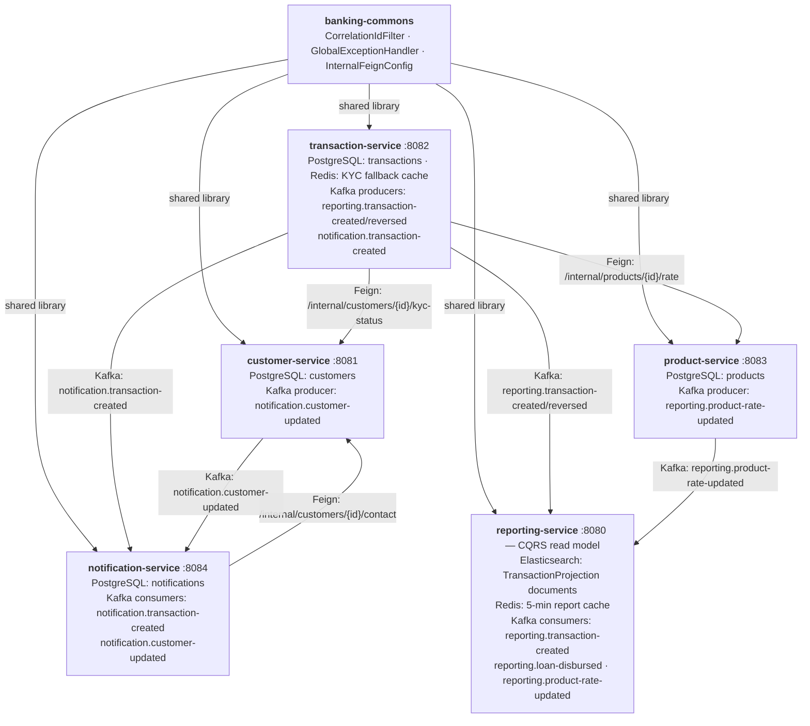

# Banking Microservices Platform

A production-grade **multi-service banking platform** implemented as a Maven multi-module project. Includes a CQRS read
model reporting service extracted from a Java 11 monolith (Strangler Fig pattern), plus four supporting microservices
sharing a common library.

**Key result:** 98.3% reduction in report generation time (120s → <2s).

## Platform Architecture



**Key Patterns:** CQRS, Event Sourcing, Strangler Fig, Saga (choreography), Circuit Breaker, Bulkhead, Correlation ID
propagation

## Maven Modules

| Module                 | Description                                                    |
|------------------------|----------------------------------------------------------------|
| `banking-commons`      | Shared library: filter, Feign config, exceptions, DLQ envelope |
| `customer-service`     | KYC management, customer profiles                              |
| `transaction-service`  | Payments, reversals, loan events                               |
| `product-service`      | Product catalogue, interest rate management                    |
| `notification-service` | Email/SMS dispatch, Kafka consumer                             |
| `reporting-service`    | CQRS read model, financial reports                             |

## Prerequisites

| Tool             | Version                 |
|------------------|-------------------------|
| Java             | 21                      |
| Maven            | 3.9+                    |
| Docker + Compose | 24+                     |
| Helm             | 3.13+                   |
| kubectl          | 1.28+                   |
| Minikube         | 1.32+ (local K8s)       |
| AWS CLI          | 2+ (for AWS deployment) |

## Local Development

### 1. Start the full local stack

```bash
# From repository root
docker-compose up -d

# Watch logs
docker-compose logs -f reporting-service
```

Services available:
| Service | URL | Description |
|---------|-----|-------------|
| customer-service | http://localhost:8081 | Customer & KYC API |
| customer-service Swagger | http://localhost:8081/swagger-ui.html | API docs |
| transaction-service | http://localhost:8082 | Payments & reversals |
| transaction-service Swagger | http://localhost:8082/swagger-ui.html | API docs |
| product-service | http://localhost:8083 | Product catalogue |
| product-service Swagger | http://localhost:8083/swagger-ui.html | API docs |
| notification-service | http://localhost:8084 | Notifications |
| reporting-service | http://localhost:8080 | CQRS reports |
| reporting-service Swagger | http://localhost:8080/swagger-ui.html | API docs |
| Mailhog (SMTP UI) | http://localhost:8025 | View sent emails |
| Elasticsearch | http://localhost:9200 | Search engine |
| Prometheus | http://localhost:9090 | Metrics |
| Grafana | http://localhost:3000 (admin/admin) | Dashboards |

### Local startup order

The docker-compose `depends_on` conditions handle ordering automatically. For manual startup:

```bash
# 1. Infrastructure
docker-compose up -d zookeeper kafka postgres redis elasticsearch mailhog

# 2. Independent services (parallel)
docker-compose up -d customer-service product-service

# 3. Dependent services
docker-compose up -d transaction-service notification-service

# 4. CQRS read model
docker-compose up -d reporting-service

# 5. Observability
docker-compose up -d prometheus grafana
```

### 2. Run services locally with Maven

```bash
# Start infrastructure only
docker-compose up -d zookeeper kafka postgres redis elasticsearch mailhog

# Run each service in a separate terminal
cd customer-service && mvn spring-boot:run -Dspring-boot.run.profiles=local
cd product-service  && mvn spring-boot:run -Dspring-boot.run.profiles=local
cd transaction-service && mvn spring-boot:run -Dspring-boot.run.profiles=local
cd notification-service && mvn spring-boot:run -Dspring-boot.run.profiles=local
cd reporting-service && mvn spring-boot:run -Dspring-boot.run.profiles=local
```

### 3. End-to-end transaction flow

```bash
# 1. Create a customer
curl -X POST http://localhost:8081/api/customers \
  -H "Content-Type: application/json" \
  -d '{"clientId":"cli-001","name":"Alice","email":"alice@bank.com","region":"DE"}'

# 2. Approve KYC
curl -X PUT http://localhost:8081/api/customers/{id}/kyc \
  -H "Content-Type: application/json" \
  -d '{"kycStatus":"APPROVED","riskTier":"LOW"}'

# 3. Create a product
curl -X POST http://localhost:8083/api/products \
  -H "Content-Type: application/json" \
  -d '{"productId":"prod-mortgage-01","name":"Standard Mortgage","type":"MORTGAGE","interestRate":0.0375}'

# 4. Process a payment (triggers KYC check + rate lookup + Kafka events)
curl -X POST http://localhost:8082/api/transactions/payments \
  -H "Content-Type: application/json" \
  -d '{"clientId":"cli-001","productId":"prod-mortgage-01","amount":15000,"currency":"EUR"}'

# 5. View financial report (after events are consumed by reporting-service)
curl "http://localhost:8080/api/reports/financial?clientId=cli-001&period=2026-03"
```

## Running Tests

### All modules from root

```bash
# Build shared library + all modules, run all tests
mvn clean verify

# Skip integration tests (faster)
mvn clean verify -DskipITs
```

### Per-service unit tests

```bash
mvn -pl banking-commons test
mvn -pl customer-service     test -Dtest="com.banking.customer.unit.*"
mvn -pl transaction-service  test -Dtest="com.banking.transaction.unit.*"
mvn -pl product-service      test -Dtest="com.banking.product.unit.*"
mvn -pl notification-service test -Dtest="com.banking.notification.unit.*"
mvn -pl reporting-service    test -Dtest="com.banking.reporting.unit.*"
```

### Per-service integration tests (requires Docker)

```bash
mvn -pl customer-service     verify -Dtest="com.banking.customer.integration.*"
mvn -pl transaction-service  verify -Dtest="com.banking.transaction.integration.*"
mvn -pl product-service      verify -Dtest="com.banking.product.integration.*"
mvn -pl notification-service verify -Dtest="com.banking.notification.integration.*"
mvn -pl reporting-service    verify -Dtest="com.banking.reporting.integration.*"
```

## Building Docker Image

```bash
cd reporting-service

# Build only
docker build -t reporting-service:local .

# Build via Maven (includes layered JAR)
mvn package -DskipTests
docker build -t reporting-service:latest .
```

## Kubernetes Deployment

### Prerequisites

```bash
# Lint the Helm chart
helm lint reporting-service/helm/reporting-service

# Dry-run
helm install reporting-service reporting-service/helm/reporting-service \
  --dry-run --debug
```

### Deploy to Minikube (local cluster)

```bash
# Start Minikube with sufficient resources
minikube start --cpus=4 --memory=6g --driver=docker

# Enable ingress addon
minikube addons enable ingress

# Start infrastructure dependencies on the host
docker-compose up -d zookeeper kafka postgres redis elasticsearch

# Build image inside Minikube's Docker daemon
eval $(minikube docker-env)
mvn -pl reporting-service package -DskipTests
docker build -t reporting-service:local reporting-service/

# Create namespace and secrets
kubectl create namespace reporting
kubectl create secret generic reporting-secrets -n reporting \
  --from-literal=POSTGRES_PASSWORD=reporting \
  --from-literal=ES_PASSWORD=""

# Deploy via Helm (image.pullPolicy=Never uses the local image)
helm upgrade --install reporting-service \
  reporting-service/helm/reporting-service \
  --namespace reporting \
  -f reporting-service/helm/reporting-service/values-dev.yaml \
  --set image.repository=reporting-service \
  --set image.tag=local \
  --set image.pullPolicy=Never \
  --set configmap.kafkaBootstrapServers=host.minikube.internal:29092 \
  --set configmap.esUris=http://host.minikube.internal:9200 \
  --set configmap.redisHost=host.minikube.internal \
  --set configmap.postgresUrl=jdbc:postgresql://host.minikube.internal:5432/reporting

# Access the service
# Option A — port-forward (simplest)
kubectl port-forward svc/reporting-service 8080:8080 -n reporting

# Option B — via ingress (run minikube tunnel in a separate terminal first)
minikube tunnel
curl http://reporting.banking.internal/api/reports/financial

# Verify
kubectl get pods -n reporting
kubectl logs -l app=reporting-service -n reporting --tail=50
```

> **Note:** `host.minikube.internal` resolves to the host machine IP from inside the Minikube VM,
> allowing pods to reach docker-compose services running on the host.

### Deploy to Dev

```bash
helm upgrade --install reporting-service \
  reporting-service/helm/reporting-service \
  --namespace reporting \
  --create-namespace \
  -f reporting-service/helm/reporting-service/values.yaml \
  -f reporting-service/helm/reporting-service/values-dev.yaml \
  --set image.tag=<SHA>
```

### Deploy to Staging

```bash
helm upgrade --install reporting-service \
  reporting-service/helm/reporting-service \
  --namespace reporting \
  -f reporting-service/helm/reporting-service/values.yaml \
  -f reporting-service/helm/reporting-service/values-staging.yaml \
  --set image.tag=<SHA>
```

### Deploy to Production (requires manual approval in CI)

```bash
helm upgrade --install reporting-service \
  reporting-service/helm/reporting-service \
  --namespace reporting \
  -f reporting-service/helm/reporting-service/values.yaml \
  -f reporting-service/helm/reporting-service/values-prod.yaml \
  --set image.tag=<SHA> \
  --atomic  # auto-rollback on failure
```

### Verify deployment

```bash
kubectl get pods -n reporting
kubectl describe hpa reporting-service -n reporting
kubectl logs -l app=reporting-service -n reporting --tail=100
```

## AWS Deployment

Deploy CloudFormation stacks in order:

```bash
# 1. ECR Repository
aws cloudformation deploy \
  --template-file reporting-service/aws/ecr.yaml \
  --stack-name banking-ecr

# 2. EKS Cluster
aws cloudformation deploy \
  --template-file reporting-service/aws/eks-cluster.yaml \
  --stack-name banking-eks \
  --parameter-overrides VpcId=vpc-xxx SubnetIds=subnet-a,subnet-b,subnet-c \
  --capabilities CAPABILITY_IAM

# 3. RDS PostgreSQL
aws cloudformation deploy \
  --template-file reporting-service/aws/rds-postgresql.yaml \
  --stack-name banking-reporting-rds \
  --parameter-overrides VpcId=vpc-xxx SubnetIds=subnet-a,subnet-b

# 4. MSK Kafka
aws cloudformation deploy \
  --template-file reporting-service/aws/msk-kafka.yaml \
  --stack-name banking-msk \
  --parameter-overrides VpcId=vpc-xxx SubnetIds=subnet-a,subnet-b,subnet-c

# 5. ElastiCache Redis
aws cloudformation deploy \
  --template-file reporting-service/aws/elasticache-redis.yaml \
  --stack-name banking-redis \
  --parameter-overrides VpcId=vpc-xxx SubnetIds=subnet-a,subnet-b,subnet-c

# 6. Amazon OpenSearch
aws cloudformation deploy \
  --template-file reporting-service/aws/opensearch.yaml \
  --stack-name banking-opensearch \
  --parameter-overrides VpcId=vpc-xxx SubnetIds=subnet-a,subnet-b,subnet-c

# 7. IAM Roles (IRSA)
aws cloudformation deploy \
  --template-file reporting-service/aws/iam.yaml \
  --stack-name banking-reporting-iam \
  --parameter-overrides EKSClusterOIDCIssuer=oidc.eks.us-east-1.amazonaws.com/id/XXX \
  --capabilities CAPABILITY_NAMED_IAM
```

## API Reference

### customer-service (port 8081)

| Method | Path                                  | Description                                |
|--------|---------------------------------------|--------------------------------------------|
| GET    | `/api/customers`                      | List customers (pageable)                  |
| GET    | `/api/customers/{id}`                 | Get customer by ID                         |
| POST   | `/api/customers`                      | Create customer                            |
| PUT    | `/api/customers/{id}`                 | Update profile                             |
| PUT    | `/api/customers/{id}/kyc`             | Update KYC status & risk tier              |
| GET    | `/internal/customers/{id}/kyc-status` | Internal: KYC for transaction-service      |
| GET    | `/internal/customers/{id}/contact`    | Internal: contact for notification-service |

### transaction-service (port 8082)

| Method | Path                             | Description                              |
|--------|----------------------------------|------------------------------------------|
| POST   | `/api/transactions/payments`     | Create payment (KYC check + rate lookup) |
| GET    | `/api/transactions/{id}`         | Get transaction                          |
| POST   | `/api/transactions/{id}/reverse` | Reverse a transaction                    |

### product-service (port 8083)

| Method | Path                           | Description                            |
|--------|--------------------------------|----------------------------------------|
| GET    | `/api/products`                | List products (pageable)               |
| GET    | `/api/products/{id}`           | Get product                            |
| POST   | `/api/products`                | Create product                         |
| PUT    | `/api/products/{id}/rate`      | Update interest rate                   |
| GET    | `/internal/products/{id}/rate` | Internal: rate for transaction-service |

### reporting-service (port 8080)

| Method | Path                        | Description                 |
|--------|-----------------------------|-----------------------------|
| GET    | `/api/reports/financial`    | Monthly financial report    |
| GET    | `/api/reports/revenue`      | Monthly revenue report      |
| GET    | `/api/reports/transactions` | Transaction list            |
| GET    | `/api/reports/dashboard`    | Real-time dashboard         |
| POST   | `/api/reports/config`       | Create/update report config |

Query parameters: `?clientId={clientId}&period={yyyy-MM}`

### Inter-service communication

```
transaction-service
  →[Feign] GET /internal/customers/{id}/kyc-status → customer-service
  →[Feign] GET /internal/products/{id}/rate        → product-service
  →[Kafka] reporting.transaction-created            → reporting-service
  →[Kafka] notification.transaction-created         → notification-service

notification-service
  →[Feign] GET /internal/customers/{id}/contact    → customer-service
  ←[Kafka] notification.transaction-created
  ←[Kafka] notification.customer-updated

reporting-service
  ←[Kafka] reporting.transaction-created
  ←[Kafka] reporting.product-rate-updated
```

### Example Response (Financial Report)

```json
{
  "clientId": "cli-001",
  "periodFrom": "2022-01-01T00:00:00Z",
  "periodTo": "2022-01-31T23:59:59Z",
  "totalAmount": 1250000.00,
  "totalTransactions": 847,
  "completedTransactions": 823,
  "reversedTransactions": 18,
  "chargebacks": 6,
  "trendPercentage": 12.5,
  "generatedAt": "2026-03-03T10:30:00Z",
  "cacheSource": "ELASTICSEARCH"
}
```

## Configuration Reference

Key environment variables:

| Variable                  | Description            | Default                                      |
|---------------------------|------------------------|----------------------------------------------|
| `POSTGRES_URL`            | PostgreSQL JDBC URL    | `jdbc:postgresql://localhost:5432/reporting` |
| `POSTGRES_USER`           | DB username            | `reporting`                                  |
| `POSTGRES_PASSWORD`       | DB password            | —                                            |
| `REDIS_HOST`              | Redis hostname         | `localhost`                                  |
| `REDIS_PORT`              | Redis port             | `6379`                                       |
| `ES_URIS`                 | Elasticsearch URIs     | `http://localhost:9200`                      |
| `KAFKA_BOOTSTRAP_SERVERS` | Kafka brokers          | `localhost:9092`                             |
| `KEYCLOAK_JWKS_URI`       | Keycloak JWKS endpoint | `http://localhost:8180/realms/banking/...`   |

## Observability

### Grafana Dashboards (pre-built panels)

1. **Kafka Consumer Lag** — per topic/partition lag
2. **Elasticsearch Query Latency** — p50/p95/p99
3. **Redis Cache Hit Rate** — cache efficiency
4. **Circuit Breaker State** — CLOSED/OPEN/HALF_OPEN transitions
5. **API RED Metrics** — Rate, Errors, Duration per endpoint
6. **HPA Scaling Events** — pod count over time

### Key Prometheus Metrics

```
# API latency
http_server_requests_seconds_bucket{application="reporting-service"}

# Circuit breaker
resilience4j_circuitbreaker_state{name="elasticsearch"}

# Cache hit rate
cache_gets_total{name="report",result="hit|miss"}

# Kafka consumer lag
kafka_consumer_records_lag_avg
```

### Log Pattern

Structured logs include `correlationId` in every line:

```
2026-03-03 10:30:00.123 [http-nio-8080-exec-1] INFO  c.b.r.api.ReportController [abc-123-def] - GET /api/reports/financial clientId=cli-001 period=2022-01
```

## Troubleshooting

### Circuit Breaker Open

```bash
# Check state
curl http://localhost:8080/actuator/health | jq '.components.circuitBreakers'

# Reset manually (dev only)
curl -X POST http://localhost:8080/actuator/circuitbreakers/elasticsearch/reset
```

### Kafka Consumer Lag

```bash
# Check consumer lag
kafka-consumer-groups.sh \
  --bootstrap-server localhost:9092 \
  --group reporting-service \
  --describe
```

### DLQ Events

```bash
# Consume DLQ events
kafka-console-consumer.sh \
  --bootstrap-server localhost:9092 \
  --topic reporting.dlq \
  --from-beginning \
  --max-messages 10
```

### Elasticsearch Index Health

```bash
curl http://localhost:9200/_cluster/health?pretty
curl http://localhost:9200/transaction_projections/_stats?pretty
```

---

## Performance Results

| Metric                        | Before (Monolith)  | After (Microservice) |
|-------------------------------|--------------------|----------------------|
| Report generation p99         | 120s               | <2s                  |
| Primary DB CPU during reports | 95%                | 55%                  |
| DB table locks                | Frequent (3–5/day) | None                 |
| Deployment frequency          | Monthly            | Daily                |

*Based on the real-world migration documented in `architecture and decoupling.md`.*
