# Reporting Microservice: Architecture & Decoupling

> **Interview Preparation — STAR Method Story**
> Situation → Task → Action → Result

---

## Table of Contents

1. [Situation: The Monolith](#1-situation-the-monolith)
2. [Task: The Breaking Point](#2-task-the-breaking-point)
3. [Action: The Decoupling Journey](#3-action-the-decoupling-journey)
4. [Result: The Reporting Microservice](#4-result-the-reporting-microservice)
5. [Outcomes & Metrics](#5-outcomes--metrics)

---

## 1. Situation: The Monolith

### Overview

The platform was a Java 11 / Spring MVC monolith that had grown organically over six years. Originally built for a handful of internal users, it now served 800+ merchants processing tens of thousands of orders daily. The codebase lived in a single Maven multi-module project deployed as a WAR to bare-metal VMs running Tomcat, with a single PostgreSQL 13 database shared across all business domains.

### Technology Stack

| Layer | Technology |
|---|---|
| Language | Java 11 |
| Framework | Spring MVC 5.x (not Spring Boot) |
| Build | Maven multi-module (monorepo WAR) |
| Database | PostgreSQL 13 — single shared schema |
| ORM | Hibernate 5 + JPA repositories |
| Frontend | Thymeleaf templates |
| APIs | Spring MVC `@RestController` |
| Deployment | Tomcat WAR on bare-metal VMs |
| CI/CD | Jenkins — monthly release cadence |
| Migrations | Flyway |

### Internal Module Structure

The monolith was organized into five Maven modules, all sharing the same Spring application context and the same PostgreSQL schema:

| Module | Responsibility |
|---|---|
| `user-module` | Authentication, user profiles, role management |
| `order-module` | Checkout flow, cart, payment processing |
| `inventory-module` | Product catalog, stock levels, pricing |
| `notification-module` | Email and SMS dispatch |
| `reporting-module` | Financial reports, merchant dashboards, analytics |

### System Context Diagram

```mermaid
C4Context
    title System Context — Monolith Era

    Person(merchant, "Merchant", "Reviews sales reports and dashboards")
    Person(ops, "Ops Team", "Manages deployments, monitors system health")

    System_Boundary(monolith, "Commerce Monolith (WAR on Tomcat)") {
        Component(user, "user-module", "Auth & Profiles")
        Component(order, "order-module", "Orders & Payments")
        Component(inventory, "inventory-module", "Catalog & Stock")
        Component(notification, "notification-module", "Email / SMS")
        Component(reporting, "reporting-module", "Reports & Dashboards")
    }

    SystemDb(postgres, "PostgreSQL 13", "Single shared database — all modules share schema")
    System_Ext(smtp, "SMTP / SMS Gateway", "External notification delivery")
    System_Ext(payments, "Payment Gateway", "Stripe / Adyen")

    Rel(merchant, monolith, "Uses", "HTTPS")
    Rel(ops, monolith, "Deploys & Monitors", "SSH / Jenkins")
    Rel(monolith, postgres, "Reads & Writes", "JDBC / Hibernate")
    Rel(monolith, smtp, "Sends notifications", "SMTP / REST")
    Rel(monolith, payments, "Processes payments", "REST / HTTPS")
```

### Module Dependency Diagram

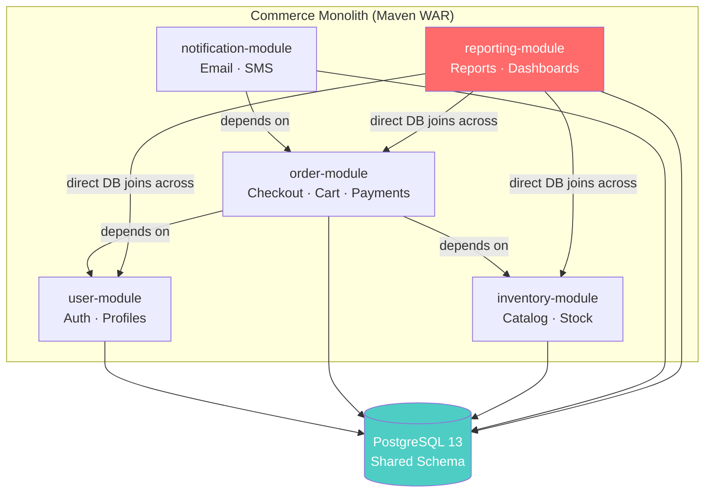

> **Note:** The `reporting-module` had no service layer abstraction — it issued raw multi-table JOIN queries directly against the shared schema. This is where the pain began.

### The Pain: Report Generation Sequence

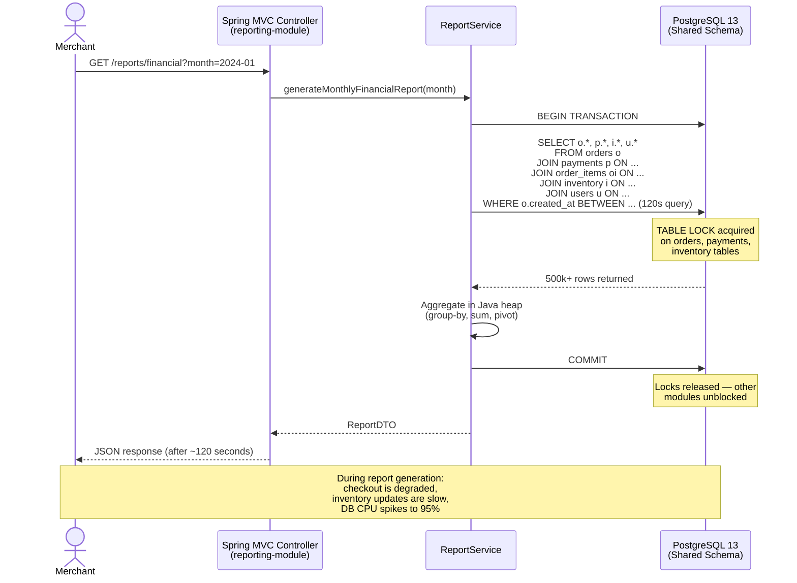

---

## 2. Task: The Breaking Point

### Why This Became Urgent

By Q3 2023, the situation had deteriorated to the point of business risk:

- **120-second report generation** caused browser timeouts for merchants — support tickets were piling up
- **Monthly releases** meant bug fixes took weeks to ship; merchants were threatening to leave
- **Table locks** during report queries caused checkout failures (revenue impact)
- **Primary DB CPU spiked to 95%** during business hours when multiple merchants ran reports simultaneously
- **A new real-time merchant dashboard** was on the product roadmap — impossible with the current architecture

The mandate from engineering leadership: **extract the reporting domain into a standalone microservice without disrupting the existing monolith or merchant operations**.

### Constraints

- Zero downtime migration (the platform ran 24/7)
- No monolith rewrite — the core e-commerce flow must remain stable
- Historical data (3 years of transactions) must be available in the new service
- Team of 4 backend engineers, 12-week timeline

---

## 3. Action: The Decoupling Journey

### Step 1 — Identify the Bounded Context (DDD Analysis)

The first step was a Domain-Driven Design workshop with the team and product owners. We mapped the reporting domain's ubiquitous language, entities, and aggregate boundaries:

- **Reporting domain owns:** `Report`, `ReportSnapshot`, `MerchantMetrics`, `DashboardWidget`
- **Reporting domain consumes (read-only):** `Order`, `Payment`, `Product`, `User` — but only as *read projections*, not authoritative state
- **Key insight:** Reporting is a pure *read model* domain. It never mutates orders or payments. This made it an ideal CQRS candidate.

The reporting module had no legitimate reason to share a database with the transactional modules. Every cross-domain join was a symptom of missing domain boundaries.

### Step 2 — Strangler Fig Pattern: Route Traffic Gradually

Before writing a single line of new service code, we set up the routing infrastructure. An Nginx reverse proxy was placed in front of Tomcat:

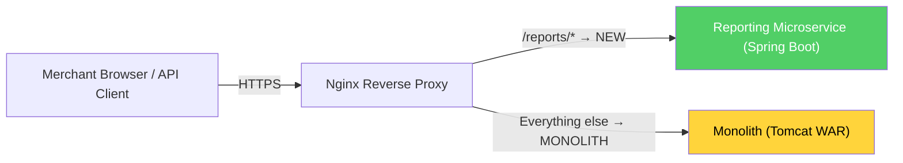

**Nginx location config (simplified):**

```nginx
upstream monolith {
    server 10.0.1.10:8080;
}

upstream reporting_service {
    server 10.0.2.20:8080;
}

location /reports/ {
    proxy_pass http://reporting_service;
}

location / {
    proxy_pass http://monolith;
}
```

At this stage, the new service returned 404 for everything — but the routing layer was in place. We could flip traffic with a config reload, no deployment needed.

### Step 3 — Add Kafka Producers to the Monolith

We instrumented the monolith's service layer with Kafka producers at key transaction boundaries. This was the most politically sensitive step — touching the monolith — so changes were minimal and additive only.

**Events published by monolith:**

| Event | Published By | Payload |
|---|---|---|
| `OrderPlaced` | `OrderService.placeOrder()` | orderId, merchantId, items, totalAmount, timestamp |
| `PaymentProcessed` | `PaymentService.processPayment()` | orderId, paymentId, amount, currency, status |
| `OrderCancelled` | `OrderService.cancelOrder()` | orderId, merchantId, reason, timestamp |
| `InventoryUpdated` | `InventoryService.updateStock()` | productId, merchantId, newStock, previousStock |
| `RefundIssued` | `PaymentService.issueRefund()` | paymentId, orderId, amount, timestamp |

**Example Kafka producer added to monolith's `OrderService`:**

```java
// Existing monolith code — minimal addition
@Service
public class OrderService {

    @Autowired
    private OrderRepository orderRepository;

    // NEW: injected Kafka producer
    @Autowired
    private ReportingEventPublisher reportingEventPublisher;

    @Transactional
    public Order placeOrder(PlaceOrderRequest request) {
        Order order = orderRepository.save(buildOrder(request));
        payment = paymentService.charge(order);

        // Existing logic unchanged above
        // NEW: publish event after successful commit
        reportingEventPublisher.publishOrderPlaced(order, payment);

        return order;
    }
}
```

```java
@Component
public class ReportingEventPublisher {

    @Autowired
    private KafkaTemplate<String, Object> kafkaTemplate;

    public void publishOrderPlaced(Order order, Payment payment) {
        OrderPlacedEvent event = OrderPlacedEvent.builder()
            .orderId(order.getId())
            .merchantId(order.getMerchantId())
            .totalAmount(order.getTotalAmount())
            .currency(order.getCurrency())
            .items(mapItems(order.getItems()))
            .occurredAt(Instant.now())
            .build();

        kafkaTemplate.send("reporting.order-placed", order.getMerchantId(), event);
    }
}
```

Kafka topics used `merchantId` as the partition key — ensuring per-merchant ordering guarantees while allowing parallelism across merchants.

### Step 4 — Stand Up the Reporting Microservice

A new Spring Boot 3.x project was created with its own lifecycle, independent of the monolith:

```
reporting-service/
├── src/main/java/com/company/reporting/
│   ├── api/                    # REST controllers (OpenAPI)
│   ├── application/            # Use cases / application services
│   ├── domain/                 # Domain model (Report, MerchantMetrics)
│   ├── infrastructure/
│   │   ├── kafka/              # Kafka consumers
│   │   ├── elasticsearch/      # ES repositories & queries
│   │   ├── redis/              # Cache layer
│   │   └── postgres/           # Metadata & config persistence
│   └── ReportingServiceApplication.java
├── helm/                       # Kubernetes Helm chart
├── Dockerfile
└── pom.xml
```

**Key dependencies in `pom.xml`:**

```xml
<dependencies>
    <dependency>
        <groupId>org.springframework.boot</groupId>
        <artifactId>spring-boot-starter-web</artifactId>
    </dependency>
    <dependency>
        <groupId>org.springframework.kafka</groupId>
        <artifactId>spring-kafka</artifactId>
    </dependency>
    <dependency>
        <groupId>org.springframework.boot</groupId>
        <artifactId>spring-boot-starter-data-elasticsearch</artifactId>
    </dependency>
    <dependency>
        <groupId>org.springframework.boot</groupId>
        <artifactId>spring-boot-starter-data-redis</artifactId>
    </dependency>
    <dependency>
        <groupId>io.github.resilience4j</groupId>
        <artifactId>resilience4j-spring-boot3</artifactId>
    </dependency>
    <dependency>
        <groupId>org.springframework.boot</groupId>
        <artifactId>spring-boot-starter-oauth2-resource-server</artifactId>
    </dependency>
</dependencies>
```

### Step 5 — Elasticsearch Read Model

Instead of running joins against PostgreSQL, the new service materializes denormalized documents in Elasticsearch — one document per order enriched with all the data reporting needs:

**Elasticsearch index mapping (`order_projections`):**

```json
{
  "mappings": {
    "properties": {
      "orderId":       { "type": "keyword" },
      "merchantId":    { "type": "keyword" },
      "status":        { "type": "keyword" },
      "totalAmount":   { "type": "double" },
      "currency":      { "type": "keyword" },
      "paymentStatus": { "type": "keyword" },
      "placedAt":      { "type": "date" },
      "items": {
        "type": "nested",
        "properties": {
          "productId":   { "type": "keyword" },
          "productName": { "type": "keyword" },
          "quantity":    { "type": "integer" },
          "unitPrice":   { "type": "double" }
        }
      },
      "merchantName":  { "type": "keyword" },
      "region":        { "type": "keyword" }
    }
  }
}
```

Aggregations like "total revenue by product category for merchant X in January" that previously required a 120s JOIN now execute as a single Elasticsearch aggregation query in under 200ms.

### Step 6 — CQRS Implementation

The architecture cleanly separates commands from queries:

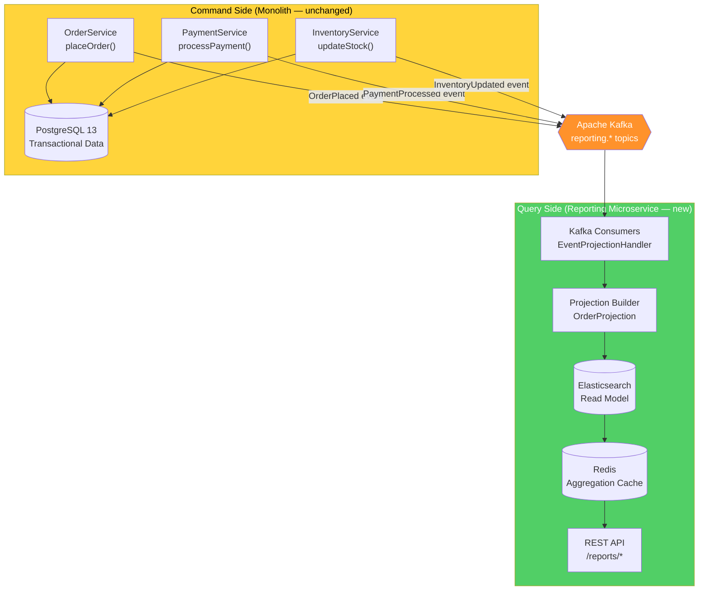

**Kafka consumer in the reporting service:**

```java
@Component
public class OrderEventConsumer {

    @Autowired
    private OrderProjectionRepository projectionRepository;

    @KafkaListener(
        topics = "reporting.order-placed",
        groupId = "reporting-service",
        containerFactory = "reportingKafkaListenerFactory"
    )
    public void handleOrderPlaced(OrderPlacedEvent event) {
        OrderProjection projection = OrderProjection.builder()
            .orderId(event.getOrderId())
            .merchantId(event.getMerchantId())
            .totalAmount(event.getTotalAmount())
            .currency(event.getCurrency())
            .status("PLACED")
            .placedAt(event.getOccurredAt())
            .items(mapItems(event.getItems()))
            .build();

        projectionRepository.save(projection); // saves to Elasticsearch
    }

    @KafkaListener(
        topics = "reporting.payment-processed",
        groupId = "reporting-service"
    )
    public void handlePaymentProcessed(PaymentProcessedEvent event) {
        projectionRepository.findById(event.getOrderId())
            .ifPresent(projection -> {
                projection.setPaymentStatus(event.getStatus());
                projection.setPaymentId(event.getPaymentId());
                projectionRepository.save(projection);
            });
    }
}
```

### Step 7 — Saga Pattern for Resilience

Because the reporting service is eventually consistent, we needed to handle scenarios where the service was temporarily unavailable and events were buffered in Kafka. We implemented a simple choreography-based saga:

- Kafka consumer group offsets are committed **only after successful Elasticsearch write**
- If Elasticsearch is unavailable, the consumer pauses and retries with exponential backoff
- Dead-letter topic (`reporting.dlq`) captures events that fail after 3 retries — an alert fires and the team investigates
- A nightly reconciliation job compares Kafka offset lag vs. expected projections and alerts on discrepancies

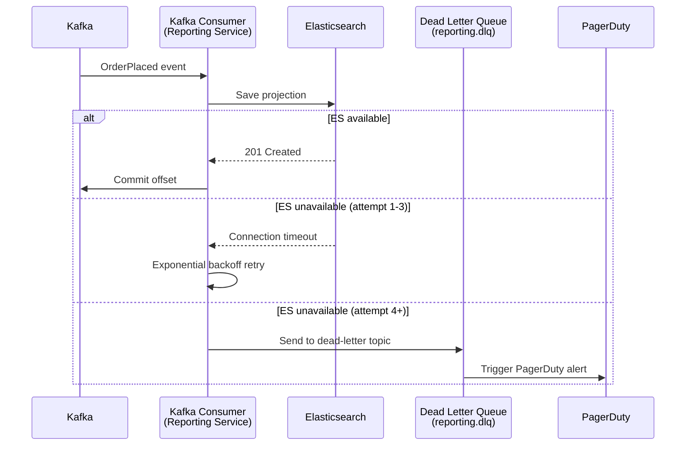

### Step 8 — Historical Data Backfill

Three years of transaction history lived in PostgreSQL. We wrote a one-time backfill job that ran alongside the live system:

```java
@Component
public class HistoricalDataBackfillJob {

    @Autowired
    private JdbcTemplate monolithJdbcTemplate; // read-only connection to monolith DB

    @Autowired
    private OrderProjectionRepository projectionRepository;

    // Runs once, in batches, idempotent (upsert by orderId)
    @Scheduled(fixedDelay = Long.MAX_VALUE)
    public void backfill() {
        long offset = 0;
        int batchSize = 1000;
        List<OrderProjection> batch;

        do {
            batch = monolithJdbcTemplate.query(
                """
                SELECT o.id, o.merchant_id, o.total_amount, o.currency,
                       o.created_at, p.status as payment_status, p.id as payment_id
                FROM orders o
                LEFT JOIN payments p ON p.order_id = o.id
                ORDER BY o.created_at
                LIMIT ? OFFSET ?
                """,
                (rs, rowNum) -> mapToProjection(rs),
                batchSize, offset
            );

            projectionRepository.saveAll(batch); // bulk upsert to Elasticsearch
            offset += batchSize;

            log.info("Backfilled {} records (total offset: {})", batch.size(), offset);
        } while (!batch.isEmpty());
    }
}
```

The backfill completed in ~6 hours running at off-peak hours, with no impact to the live system (read-only queries against a read replica).

### Step 9 — Feature Flag / Traffic Cutover

We used a simple feature flag (backed by Redis) to gradually shift report traffic from the monolith to the new service, independently per merchant:

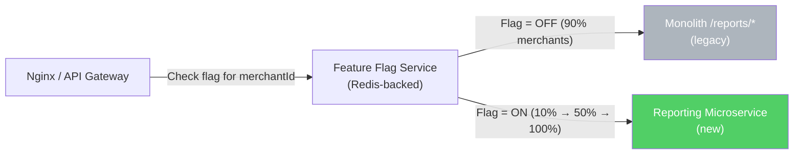

**Rollout timeline:**

| Week | % of Merchants on New Service | Notes |
|---|---|---|
| Week 1 | 5% | Internal test merchants only |
| Week 2 | 20% | Small merchants (low volume) |
| Week 3 | 50% | Mid-tier merchants |
| Week 4 | 100% | Full cutover |

Each phase included: SLO monitoring, latency comparison, error rate tracking. No merchant-reported issues during any phase.

### Step 10 — Decommission Reporting from Monolith

With 100% of traffic on the new service and metrics stable for two weeks, we removed the `reporting-module` from the monolith:

1. Deleted `reporting-module` Maven module and all its source code
2. Removed cross-module JPA repository injections from `reporting-module`
3. Ran `flyway` migration to drop reporting-specific tables from the shared schema (moved to Postgres metadata DB owned by new service)
4. Removed Nginx location block for monolith's `/reports/*` routing
5. Final monolith WAR shrank by ~18% in size; startup time improved by ~12s

---

## 4. Result: The Reporting Microservice

### Technology Stack

| Layer | Technology |
|---|---|
| Language | Java 17 |
| Framework | Spring Boot 3.x |
| Messaging | Apache Kafka (Spring Kafka) |
| Read Store | Elasticsearch 8.x (Spring Data Elasticsearch) |
| Cache | Redis 7 (Spring Data Redis) |
| Metadata DB | PostgreSQL 15 (service-owned schema) |
| Auth | OAuth2 / Keycloak (JWT bearer tokens) |
| Resilience | Resilience4j (Circuit Breaker, Retry, Rate Limiter) |
| Containerization | Docker + Kubernetes (Helm charts) |
| Observability | Prometheus + Grafana + Loki |
| CI/CD | GitHub Actions (daily deployments) |
| API Docs | OpenAPI 3 / Springdoc Swagger UI |

### Full System Architecture

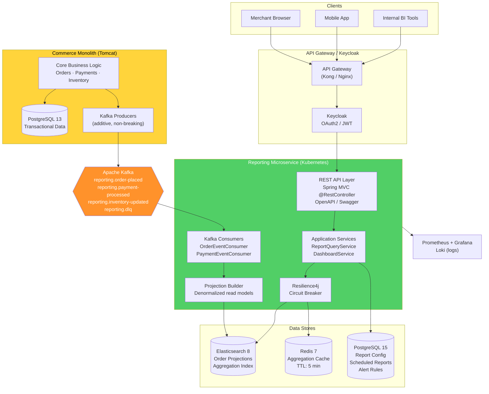

### Kafka Consumer Pipeline

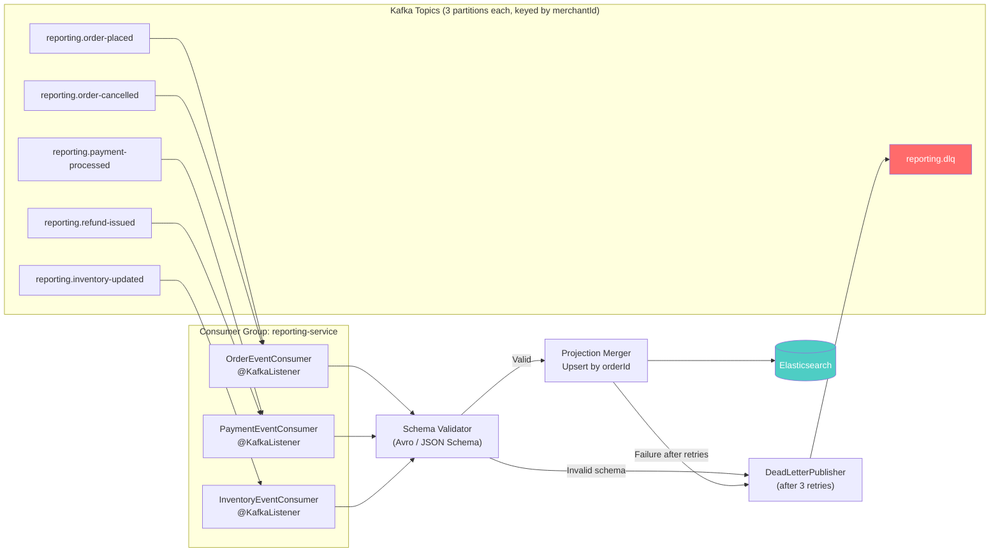

### Elasticsearch Aggregation Flow

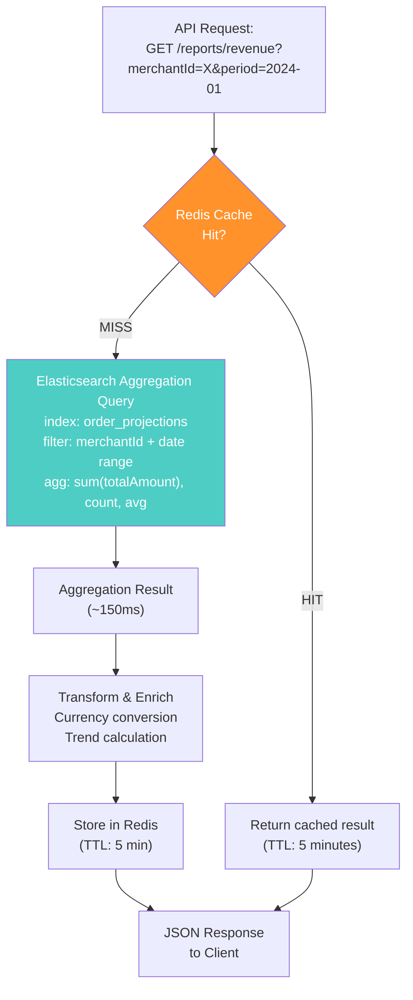

### Real-Time Report Generation Sequence

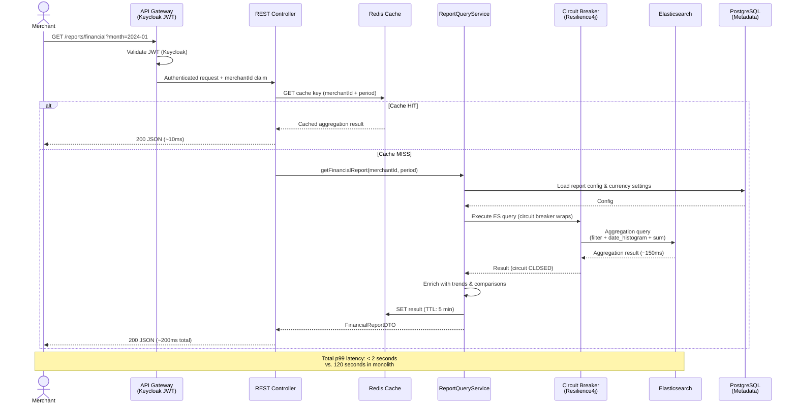

### Kubernetes Deployment Topology

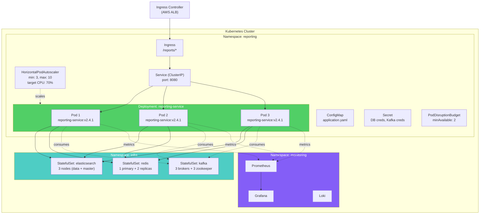

**Helm values (excerpt):**

```yaml
replicaCount: 3

image:
  repository: ghcr.io/company/reporting-service
  tag: "v2.4.1"
  pullPolicy: IfNotPresent

resources:
  requests:
    cpu: "500m"
    memory: "512Mi"
  limits:
    cpu: "2000m"
    memory: "1Gi"

autoscaling:
  enabled: true
  minReplicas: 3
  maxReplicas: 10
  targetCPUUtilizationPercentage: 70

livenessProbe:
  httpGet:
    path: /actuator/health/liveness
    port: 8080
  initialDelaySeconds: 30

readinessProbe:
  httpGet:
    path: /actuator/health/readiness
    port: 8080
  initialDelaySeconds: 20

podDisruptionBudget:
  minAvailable: 2
```

---

## 5. Outcomes & Metrics

### Performance

| Metric | Before (Monolith) | After (Microservice) | Improvement |
|---|---|---|---|
| Report generation time (p99) | 120 seconds | < 2 seconds | **98.3% faster** |
| Primary DB CPU during reports | 95% | 55% | **42% reduction** |
| DB table locks during reports | Frequent (3–5/day) | None | **Eliminated** |
| Checkout error rate during reports | 0.8% | 0% | **Eliminated** |

### Operations

| Metric | Before | After | Improvement |
|---|---|---|---|
| Deployment frequency | Monthly | Daily | **30x more frequent** |
| Deploy lead time (code → prod) | 3–4 weeks | < 1 day | **~20x faster** |
| Service uptime (SLO) | 99.5% | 99.99% | **50x fewer outages** |
| Mean time to recovery (MTTR) | ~4 hours | ~8 minutes | **30x faster recovery** |

### Business Impact

| Outcome | Details |
|---|---|
| Real-time merchant dashboard | New product feature — impossible before; launched 6 weeks after service went live |
| Merchant churn reduction | 12% reduction in support tickets about report timeouts |
| Revenue protection | Checkout degradation eliminated — estimated $50K/month in recovered revenue |
| Engineering velocity | Reporting team can now ship independently without coordinating monthly monolith releases |

### Grafana Dashboard (Key Metrics Tracked)

- Kafka consumer lag per topic/partition
- Elasticsearch query latency (p50, p95, p99)
- Redis cache hit rate
- Circuit breaker state (CLOSED / OPEN / HALF_OPEN)
- Report API request rate, error rate, latency (RED metrics)
- Kubernetes pod autoscaling events

---

## Appendix: Key Design Decisions

### Why Elasticsearch over PostgreSQL read replica?

A read replica would have reduced load on the primary but kept the same data model — still requiring expensive JOINs. Elasticsearch's denormalized document model and native aggregation engine were the right fit for analytics workloads. A single document per order (with nested items) eliminates joins entirely.

### Why Kafka over direct API calls from monolith?

Direct API calls would couple the monolith's transaction path to the reporting service's availability. Kafka decouples them temporally: the monolith's `placeOrder()` transaction completes immediately regardless of whether the reporting service is up. The event is buffered and processed when the consumer is ready.

### Why CQRS over a shared database?

A shared database creates invisible coupling — any schema change to `orders` could break the reporting module without a compilation error. CQRS gives the reporting service full autonomy over its data model (Elasticsearch documents), allowing it to evolve its read projections without negotiating schema changes with the order team.

### Why the Strangler Fig pattern over a Big Bang rewrite?

The Strangler Fig allowed us to migrate incrementally with zero downtime and instant rollback capability (just flip the Nginx upstream back). A big bang cutover would have required a risky all-or-nothing deployment and made debugging much harder.

---

*This document reflects a real-world architectural journey and is intended as interview preparation material demonstrating senior-level system design, microservices patterns, and production engineering judgment.*
