# Architecture of the Fully Decoupled Banking Platform

> **Interview Preparation — Complete Target-State Architecture**
> All 18 microservice patterns mapped to real components across all five domain services.

---

## Table of Contents

1. [Overview](#1-overview)
2. [Service Landscape](#2-service-landscape)
3. [Pattern Map](#3-pattern-map)
4. [Detailed Architecture](#4-detailed-architecture)
   - [4.1 API Gateway & BFF Layer](#41-api-gateway--bff-layer)
   - [4.2 Service Discovery](#42-service-discovery)
   - [4.3 Domain Services & Database per Service](#43-domain-services--database-per-service)
   - [4.4 Event-Driven Architecture & Smart Endpoints, Dumb Pipes](#44-event-driven-architecture--smart-endpoints-dumb-pipes)
   - [4.5 CQRS & Event Sourcing (Reporting Service deep-dive)](#45-cqrs--event-sourcing-reporting-service-deep-dive)
   - [4.6 Saga Pattern — Distributed Transactions](#46-saga-pattern--distributed-transactions)
   - [4.7 Resilience Patterns (Circuit Breaker, Bulkhead, Retry)](#47-resilience-patterns-circuit-breaker-bulkhead-retry)
   - [4.8 Data Sharding](#48-data-sharding)
   - [4.9 Sidecar Pattern (Observability)](#49-sidecar-pattern-observability)
   - [4.10 Consumer-Driven Contracts](#410-consumer-driven-contracts)
   - [4.11 Strangler Fig (Migration History)](#411-strangler-fig-migration-history)
   - [4.12 Shadow Deployment](#412-shadow-deployment)
   - [4.13 Stateless Services](#413-stateless-services)
5. [Full System Architecture Diagram](#5-full-system-architecture-diagram)
6. [Kafka Event Topology](#6-kafka-event-topology)
7. [Data Store Ownership Map](#7-data-store-ownership-map)
8. [Deployment Topology](#8-deployment-topology)
9. [Pattern Reference Index](#9-pattern-reference-index)

---

## 1. Overview

The banking platform was extracted from a Java 11 Spring MVC monolith into five fully independent Spring Boot 4.x (Java 21) microservices using the **Strangler Fig** pattern. Each service is independently deployable, owns its data store, and communicates exclusively via Kafka events (writes) or REST (reads). The shared PostgreSQL schema is gone. There are no cross-service JPA repositories. Monthly releases have been replaced by daily CI/CD pipeline deployments.

This document describes the **complete target-state architecture** — all five services fully decoupled — and explicitly maps all 18 requested microservice patterns to the real components that implement them.

### Platform at a Glance

| Concern | Solution |
|---|---|
| Edge routing | Kong API Gateway (DB-less, declarative) |
| Client optimisation | Web BFF, Mobile BFF, BI BFF |
| Service discovery | Kubernetes DNS (`service.namespace.svc.cluster.local`) |
| Async messaging | Apache Kafka 4.x (Spring Kafka) |
| Resilience | Resilience4j 3.x (CB + Retry + Bulkhead + TimeLimiter) |
| Read model | Elasticsearch 9 + Redis 8 (Reporting Service) |
| Observability | Prometheus + Grafana + Loki + PagerDuty |
| Contracts | Pact broker (consumer-driven contract tests) |
| Deployment | Kubernetes (Helm 3) + GitHub Actions (7-stage pipeline) |

---

## 2. Service Landscape

Five domain services extracted from the monolith, each with its own data store and deployment lifecycle:

| Service | Responsibility | Own DB | Exposes |
|---|---|---|---|
| **Customer Service** | KYC, profiles, authentication | PostgreSQL (`customers` schema) | `GET /api/customers/{id}`, KYC check |
| **Transaction Service** | Payments, transfers, loans, account ops | PostgreSQL (`transactions` schema) | `POST /api/transactions`, loan ops |
| **Product Service** | Bank product catalog, interest rates, terms | PostgreSQL (`products` schema) | `GET /api/products`, rate lookup |
| **Notification Service** | Email + SMS + push dispatch | PostgreSQL (`notifications` schema) | Internal only; triggered by Kafka |
| **Reporting Service** | Read model, dashboards, analytics | Elasticsearch + Redis + PostgreSQL (metadata) | `GET /api/reports/*`, dashboards |

Plus infrastructure and BFF layer:

| Component | Role |
|---|---|
| **Web BFF** | Aggregates Customer + Transaction + Reporting for branch manager web UI |
| **Mobile BFF** | Lightweight response shaping for mobile clients (smaller payloads, push integration) |
| **BI BFF** | Bulk export + streaming API for Tableau / Metabase |
| **Kong API Gateway** | Edge routing, rate limiting, correlation-ID injection |
| **Apache Kafka** | Event bus — `reporting.*`, `notification.*`, `audit.*` topic families |

---

## 3. Pattern Map

Quick-reference table: all 18 patterns and where they live in the platform.

| # | Pattern | Component(s) |
|---|---|---|
| 1 | **API Gateway** | Kong (DB-less mode) — edge routing, rate limiting, `X-Correlation-Id` injection |
| 2 | **BFF (Backend for Frontend)** | Web BFF, Mobile BFF, BI BFF — each aggregates different downstream APIs |
| 3 | **Service Discovery** | Kubernetes DNS — `service-name.namespace.svc.cluster.local`; no Eureka |
| 4 | **Circuit Breaker** | Resilience4j `CircuitBreaker` on every Feign client and Elasticsearch queries |
| 5 | **Bulkhead** | Resilience4j `Bulkhead` — thread pool isolation: ES (20 concurrent), Kafka (separate thread groups) |
| 6 | **Retry** | Resilience4j `Retry` — 3 attempts, exponential backoff 1 s → 2 s → 4 s on transient failures |
| 7 | **Saga (Choreography)** | Loan disbursement flow: Transaction → Kafka → Notification → Kafka → Audit; compensating events on failure |
| 8 | **Event Sourcing** | Kafka topics as append-only log; Reporting Service rebuilds projections by replaying from offset 0 |
| 9 | **CQRS** | Command side: transactional PostgreSQL in Transaction/Product/Customer; Query side: Elasticsearch in Reporting |
| 10 | **Database per Service** | Five services, five isolated PostgreSQL schemas/clusters; no shared tables |
| 11 | **Data Sharding** | Kafka partitions keyed by `clientId`; Elasticsearch shard routing by `clientId` |
| 12 | **Sidecar** | Prometheus JMX exporter + Fluent Bit log shipper sidecar on every pod |
| 13 | **Smart Endpoints, Dumb Pipes** | Kafka as pure byte transport; all business logic in consumer services, not in Kafka Streams |
| 14 | **Event-Driven Architecture** | All cross-service state changes via Kafka; no synchronous calls for writes |
| 15 | **Consumer-Driven Contracts (CDC)** | Pact broker — Reporting Service publishes consumer contracts; Transaction Service verifies on each build |
| 16 | **Strangler Fig** | Nginx routing layer + feature flags per `clientId`; incremental traffic cutover 5 → 20 → 50 → 100% |
| 17 | **Shadow Deployment** | New versions deployed alongside current; Nginx `mirror` directive shadows 10% of traffic; results compared, not returned |
| 18 | **Stateless Services** | All pods stateless; sessions in Redis, Kafka offsets in brokers, files in S3 |

---

## 4. Detailed Architecture

### 4.1 API Gateway & BFF Layer

#### API Gateway — Kong

Kong operates in **DB-less declarative mode**. The full gateway configuration lives in a `kong.yaml` file versioned in `infra-helm-charts` and applied via Helm on every deployment. Kong is the **single ingress point** for all external traffic. Service-to-service calls inside the cluster travel over Kubernetes DNS and never re-enter Kong.

**Kong responsibilities:**

- **Rate limiting**: Per-consumer sliding-window limits enforced at the gateway before requests reach services (300 req/min for customer routes, 600 req/min for transactions).
- **SSL termination**: TLS 1.3 terminated at Kong; inter-cluster traffic is plain HTTP.
- **`X-Correlation-Id` injection**: Kong generates a UUID v4 if absent and injects it before forwarding. All downstream services propagate it through to their log output and downstream calls.
- **Request/response logging**: Access logs emitted to stdout, scraped by Loki.

**Routing table:**

| Path Prefix | Upstream Service | Internal DNS |
|---|---|---|
| `/api/customers/*` | Customer Service | `customer-service.banking.svc.cluster.local:8080` |
| `/api/transactions/*` | Transaction Service | `transaction-service.banking.svc.cluster.local:8080` |
| `/api/products/*` | Product Service | `product-service.banking.svc.cluster.local:8080` |
| `/api/reports/*` | Reporting Service | `reporting-service.banking.svc.cluster.local:8080` |
| `/api/notifications/*` | Notification Service (admin) | `notification-service.banking.svc.cluster.local:8080` |

#### BFF Layer

Three BFF services sit between Kong and the domain services, each optimised for a different client type:

| BFF | Client | Aggregation strategy |
|---|---|---|
| **Web BFF** | Branch manager browser UI | Combines Customer profile + recent Transactions + Reporting summaries into one response; server-side aggregation reduces client round-trips |
| **Mobile BFF** | iOS / Android mobile app | Strips payload to essential fields; smaller JSON footprint; handles FCM/APNs push token registration |
| **BI BFF** | Tableau / Metabase | Exposes chunked streaming endpoints and bulk CSV/Parquet export; long-lived HTTP streaming responses |

Each BFF is a separate Spring Boot 4.x service with its own Kubernetes Deployment. BFFs call domain services synchronously over Feign (with Resilience4j wrapping) and never access data stores directly.

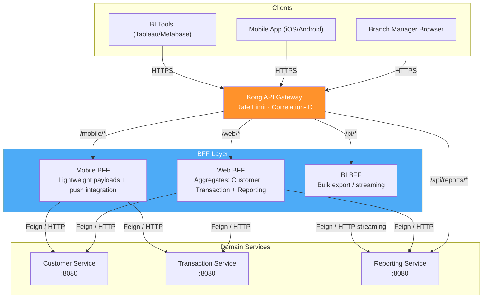

---

### 4.2 Service Discovery

The platform uses **Kubernetes DNS** as its service registry — no Eureka, no Consul, no client-side registry. Every Kubernetes `Service` object automatically receives a stable DNS entry:

```
<service-name>.<namespace>.svc.cluster.local:<port>
```

**Examples:**

```
customer-service.banking.svc.cluster.local:8080
transaction-service.banking.svc.cluster.local:8080
reporting-service.banking.svc.cluster.local:8080
```

Feign clients reference these names directly in `application.yaml`:

```yaml
feign:
  clients:
    customer-service:
      url: http://customer-service.banking.svc.cluster.local:8080
    product-service:
      url: http://product-service.banking.svc.cluster.local:8080
```

When Kubernetes restarts or reschedules a pod, the DNS record updates automatically — no service registry synchronisation lag. Resilience4j Circuit Breakers sit in front of every Feign call to handle the transient period during pod restarts.

---

### 4.3 Domain Services & Database per Service

Each of the five domain services owns its data store exclusively. No service reads or writes another service's database. Cross-domain data access happens only via published events (Kafka) or explicit API calls.

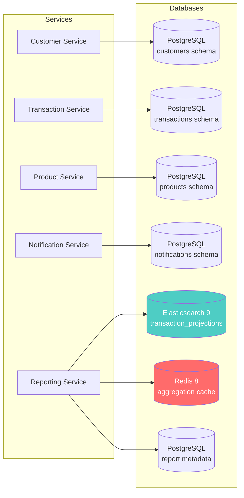

**Why separate schemas?**

When `reporting-module` shared PostgreSQL with `transaction-module`, a schema change to the `transactions` table could silently break reporting queries — caught only at runtime. With **Database per Service**, each service controls its own schema evolution via Flyway migrations. There are no cross-service JPA repositories. A change to the `transactions` table requires an event contract update (verified by Pact), not a coordinated schema migration.

---

### 4.4 Event-Driven Architecture & Smart Endpoints, Dumb Pipes

#### Event-Driven Architecture

All cross-service **write-path state changes** flow through Kafka events. No service calls another service's API to trigger a state mutation. This means:

- **Transaction Service** publishes `TransactionCreated`, `LoanDisbursed`, `TransactionReversed` — it does not call Reporting Service or Notification Service.
- **Product Service** publishes `ProductRateUpdated` — it does not push rate changes directly to Reporting.
- **Notification Service** consumes `notification.*` events — it is never called synchronously by Transaction Service.

Synchronous REST (Feign) is used only for **read-path lookups** where a response is needed inline (e.g., Transaction Service → Customer Service for KYC check before processing a payment).

#### Smart Endpoints, Dumb Pipes

Kafka is used as **pure byte transport** — a durable, ordered, partitioned message queue. There are no Kafka Streams topologies, no stream-processing joins, no business logic embedded in the broker. All enrichment, transformation, and routing decisions live inside the consumer service (the "smart endpoint"). This keeps the pipeline simple and testable: consumers can be tested in isolation without spinning up Kafka.

**Contrast with a "dumb endpoint, smart pipe" anti-pattern:**
```
# Anti-pattern (avoided):
Transaction Service → Kafka Streams topology (enriches, routes, transforms) → Reporting Service
# Problem: business logic lives in infrastructure; harder to test; Kafka Streams state stores introduce operational complexity

# Actual approach:
Transaction Service → Kafka (raw event) → Reporting Service consumer (enriches, builds projection, persists to ES)
# Business logic in the service; Kafka is just the reliable delivery mechanism
```

---

### 4.5 CQRS & Event Sourcing (Reporting Service deep-dive)

#### CQRS

The platform cleanly separates **command** (write) and **query** (read) responsibilities:

- **Command side**: Transaction Service, Product Service, and Customer Service handle all mutations against their own PostgreSQL databases. These are the systems of record.
- **Query side**: Reporting Service maintains a denormalised Elasticsearch read model, optimised for aggregation queries. It has no write API — it receives all data via Kafka events.

This separation means the read model can be structured entirely for query performance (denormalised documents, pre-joined fields, ES aggregations) without compromising the integrity of the write model.

#### Event Sourcing

Kafka topics act as an **append-only event log**. The Reporting Service treats the `reporting.*` topic family as its source of truth. If the Elasticsearch index is corrupted or needs to be rebuilt, the service can replay all events from `offset=0` on any topic partition and reconstruct the full projection state — no data loss, no coordination with other services.

**Projection rebuild command:**

```bash
# Reset consumer group offsets to beginning and restart — ES index is rebuilt from Kafka log
kafka-consumer-groups.sh \
  --bootstrap-server kafka.infra.svc.cluster.local:9092 \
  --group reporting-service \
  --reset-offsets --to-earliest --all-topics --execute
```

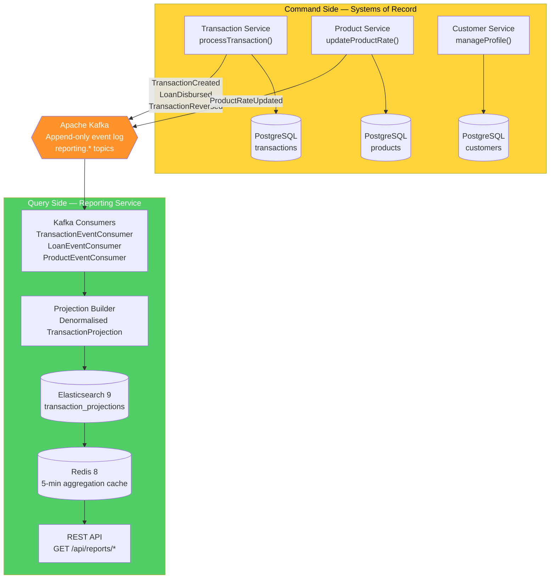

**Kafka consumer — offset commit only after successful ES write:**

```java
@KafkaListener(
    topics = "reporting.transaction-created",
    groupId = "reporting-service",
    containerFactory = "reportingKafkaListenerFactory"
)
public void handleTransactionCreated(TransactionCreatedEvent event) {
    TransactionProjection projection = buildProjection(event);
    projectionRepository.save(projection); // ES write — if this throws, offset is NOT committed
    // Spring Kafka commits offset only after this method returns successfully
}
```

---

### 4.6 Saga Pattern — Distributed Transactions

The platform uses **choreography-based sagas** — there is no central orchestrator. Each service publishes events and reacts to events; compensating events undo partial work on failure.

#### Loan Disbursement Saga (happy path + compensation)

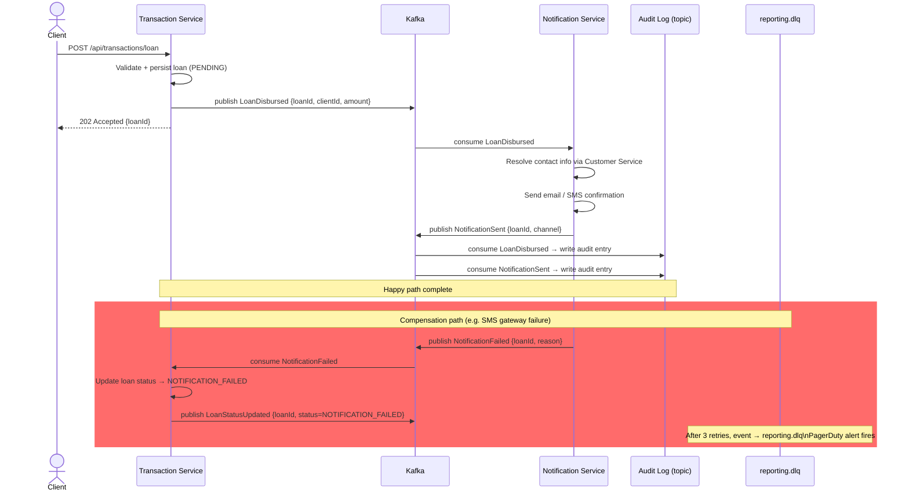

**Why choreography over orchestration?**

An orchestrator (e.g., a `LoanSagaOrchestrator` service) would become a single point of failure and coupling. Choreography keeps each service autonomous — Transaction Service does not need to know that Notification Service exists; it only publishes facts about what happened. Services subscribe to the facts they care about.

---

### 4.7 Resilience Patterns (Circuit Breaker, Bulkhead, Retry)

All three Resilience4j patterns are applied together on each outbound call. The order of decoration matters:

```
Bulkhead → CircuitBreaker → Retry → actual call
```

If the bulkhead rejects the call (thread pool full), the circuit breaker and retry never fire — fast fail. If the circuit is OPEN, retry never fires — fast fail. Retry only fires on transient failures when the circuit is CLOSED.

#### Circuit Breaker

Implemented with `resilience4j-spring-boot4`. Each Elasticsearch query and each Feign client call is wrapped:

```yaml
resilience4j:
  circuitbreaker:
    instances:
      elasticsearch:
        slidingWindowSize: 10
        failureRateThreshold: 50          # OPEN after 5/10 failures
        waitDurationInOpenState: 30s      # stays OPEN for 30s
        permittedNumberOfCallsInHalfOpenState: 3
      customer-service:
        slidingWindowSize: 10
        failureRateThreshold: 50
        waitDurationInOpenState: 15s
```

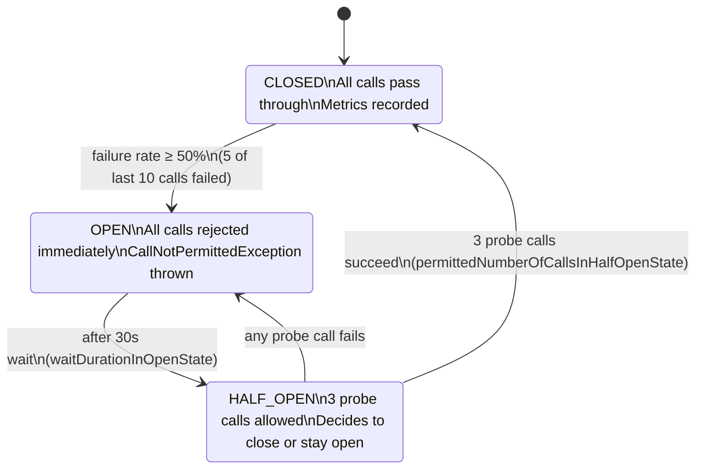

#### Bulkhead

Thread pool isolation prevents one slow dependency from exhausting the shared thread pool:

```yaml
resilience4j:
  bulkhead:
    instances:
      elasticsearch:
        maxConcurrentCalls: 20        # max 20 concurrent ES queries
        maxWaitDuration: 100ms        # queue wait before rejection
      customer-service:
        maxConcurrentCalls: 10
        maxWaitDuration: 50ms
```

Kafka consumers run in separate `@KafkaListener` thread groups (configured via `ConcurrentKafkaListenerContainerFactory`), isolated from the REST request thread pool entirely.

#### Retry

```yaml
resilience4j:
  retry:
    instances:
      elasticsearch:
        maxAttempts: 3
        waitDuration: 1s
        enableExponentialBackoff: true
        exponentialBackoffMultiplier: 2   # 1s → 2s → 4s
        retryExceptions:
          - java.io.IOException
          - org.elasticsearch.client.ResponseException
        ignoreExceptions:
          - com.banking.reporting.domain.exception.ReportNotFoundException
```

After 3 failed attempts, the exception propagates to the circuit breaker to record the failure. For Kafka consumers, failed messages are routed to `reporting.dlq` after 3 retries with `SeekToCurrentErrorHandler` + `DeadLetterPublishingRecoverer`.

---

### 4.8 Data Sharding

Two independent sharding mechanisms provide horizontal scalability:

#### Kafka Partition Sharding

All producers use `clientId` as the Kafka partition key:

```java
kafkaTemplate.send("reporting.transaction-created", event.getClientId(), event);
```

With 6 partitions per topic, all events for a given client are routed to the same partition, guaranteeing **per-client ordering** (transactions for client A are always processed in sequence). Events for different clients are processed in parallel across partition consumers.

#### Elasticsearch Shard Routing

Documents are indexed with `clientId` as the routing value:

```java
IndexQuery query = new IndexQueryBuilder()
    .withId(projection.getTransactionId())
    .withObject(projection)
    .withRouting(projection.getClientId())   // shard routing
    .build();
```

This ensures all documents for a given client land on the same shard, enabling efficient `clientId`-scoped aggregations without scatter-gather across all shards. The `transaction_projections` index uses 3 primary shards + 1 replica.

---

### 4.9 Sidecar Pattern (Observability)

Every application pod runs two sidecar containers alongside the main application container:

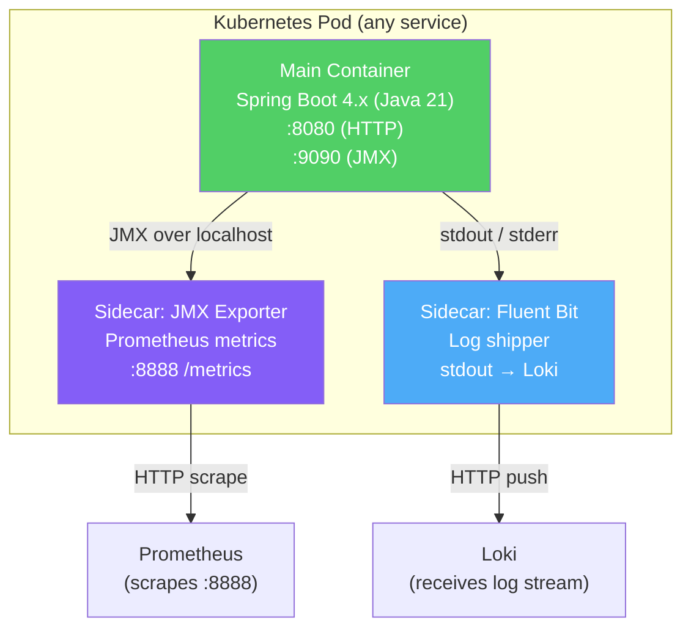

**JMX Exporter sidecar** (`prom/jmx_exporter`) converts JVM MBeans and Spring Boot Actuator metrics (heap, GC, Hikari connection pool, Kafka consumer lag, Resilience4j circuit breaker state) into Prometheus exposition format. Prometheus scrapes it every 15 seconds.

**Fluent Bit sidecar** (`fluent/fluent-bit`) tails the shared `/var/log/app/` volume (or reads from the container's stdout via the Docker logging driver), parses JSON log lines, enriches with pod labels (`service`, `namespace`, `pod`, `version`), and ships to Loki. Grafana queries both Prometheus metrics and Loki logs in the same dashboard.

**Pod manifest excerpt:**

```yaml
spec:
  containers:
    - name: reporting-service           # main container
      image: ghcr.io/company/reporting-service:v2.4.1
      ports:
        - containerPort: 8080

    - name: jmx-exporter               # sidecar 1
      image: prom/jmx_exporter:1.5.0
      ports:
        - containerPort: 8888
      volumeMounts:
        - name: jmx-config
          mountPath: /opt/jmx_exporter/config.yaml
          subPath: config.yaml

    - name: fluent-bit                  # sidecar 2
      image: fluent/fluent-bit:4.2.3
      volumeMounts:
        - name: varlog
          mountPath: /var/log
```

---

### 4.10 Consumer-Driven Contracts

The Reporting Service is a **consumer** of events produced by Transaction Service and Product Service. Schema evolution of Kafka event payloads is governed by **Pact** consumer-driven contracts.

**Flow:**

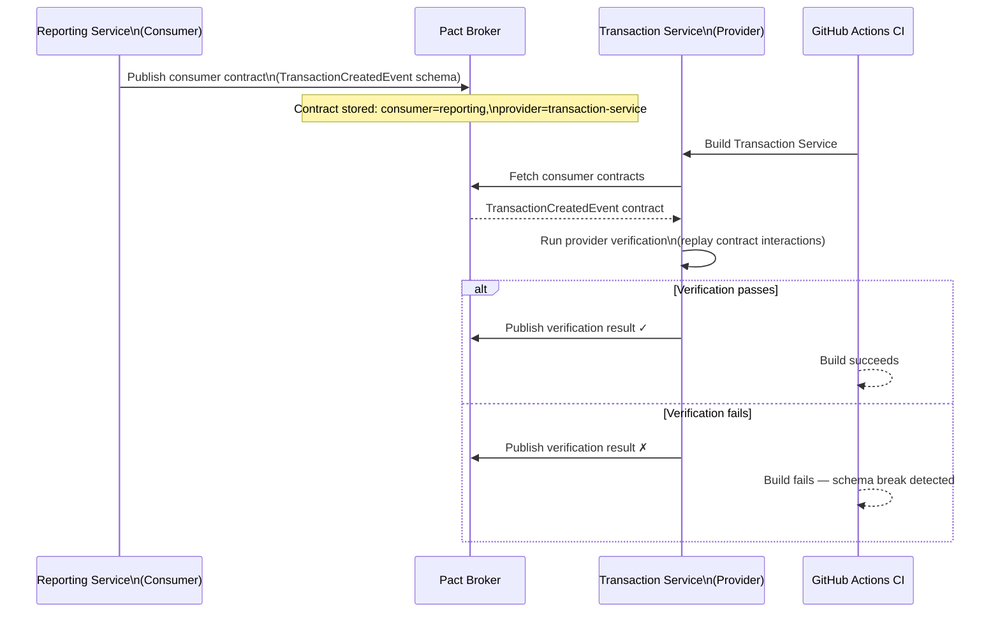

**Consumer contract definition (Reporting Service test):**

```java
@ExtendWith(PactConsumerTestExt.class)
@PactTestFor(providerName = "transaction-service", port = "8090")
class TransactionEventContractTest {

    @Pact(consumer = "reporting-service")
    public MessagePact transactionCreatedPact(MessagePactBuilder builder) {
        return builder
            .expectsToReceive("a TransactionCreated event")
            .withContent(new PactDslJsonBody()
                .stringType("transactionId")
                .stringType("clientId")
                .decimalType("amount")
                .stringType("currency")
                .stringType("productType")
                .datetime("occurredAt", "yyyy-MM-dd'T'HH:mm:ss'Z'"))
            .toPact();
    }
}
```

This contract is published to the Pact broker on every Reporting Service CI build. The Transaction Service CI pipeline fetches and verifies it — if Transaction Service adds a field without notifying Reporting, the Reporting CI may fail (missing field); if Transaction Service removes a field the Reporting Service expects, Transaction Service's own CI fails (provider verification).

---

### 4.11 Strangler Fig (Migration History)

The Strangler Fig pattern was used to extract all five services from the monolith incrementally. The reporting-module was extracted first (proving the pattern), followed by the remaining four modules over subsequent quarters.

**Migration approach for each module:**

1. **Routing layer first** — Nginx placed in front of Tomcat; new service returns 404 for everything initially.
2. **Kafka producers added to monolith** — Additive-only changes. Monolith publishes domain events alongside its existing writes.
3. **New service built** — Spring Boot 4.x project, own DB, Kafka consumers.
4. **Historical data backfill** — One-time read-only queries against monolith DB read replica; idempotent upsert into new service's data store.
5. **Feature flag traffic cutover** — Per-`clientId` flags backed by Redis. Traffic shifts gradually: 5% → 20% → 50% → 100%.
6. **Module decommission** — Source code deleted from monolith, cross-domain JPA repositories removed, Flyway migration drops shared tables.

**Traffic cutover timeline:**

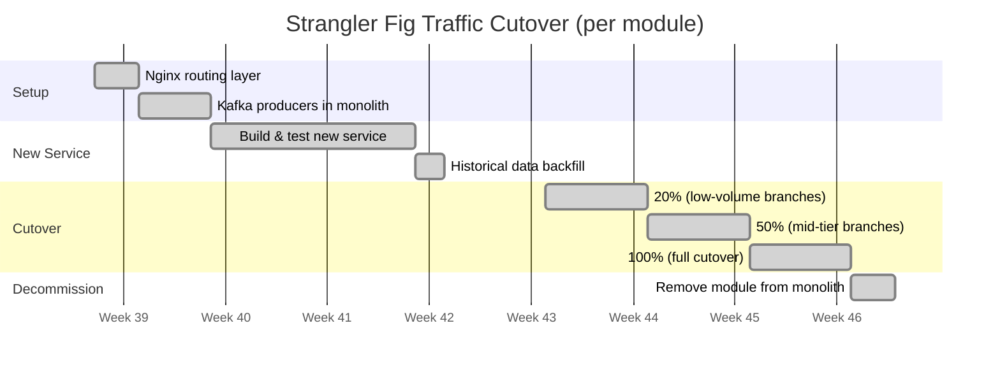

**Nginx feature-flag routing (simplified):**

```nginx
location /reports/ {
    set $target http://monolith_upstream;

    # Lua script checks Redis for clientId flag
    access_by_lua_block {
        local clientId = ngx.var.http_x_client_id
        local redis = require "resty.redis"
        local r = redis:new()
        r:connect("redis.infra.svc.cluster.local", 6379)
        local flag = r:get("feature:reporting-service:" .. clientId)
        if flag == "enabled" then
            ngx.var.target = "http://reporting_service_upstream"
        end
    }

    proxy_pass $target;
}
```

---

### 4.12 Shadow Deployment

Before fully cutting over a new major version of any service, the platform runs a **shadow deployment**: the new version receives a copy of real production traffic in parallel, processes it, but its responses are **discarded** — never returned to the client.

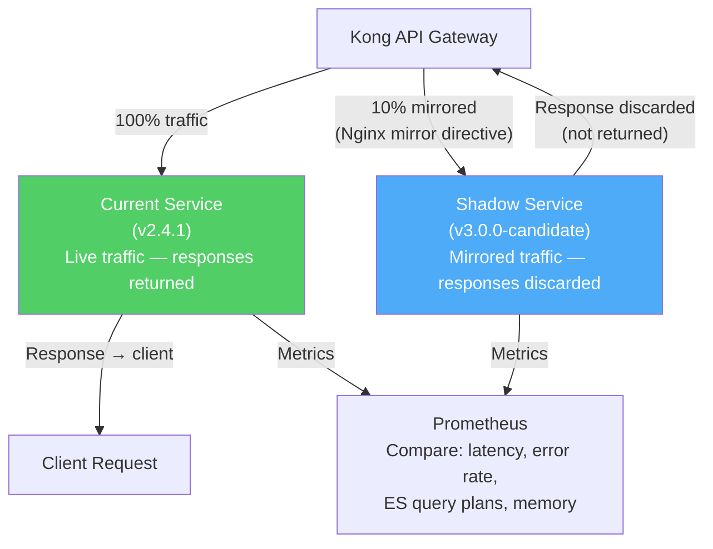

**Nginx mirror configuration:**

```nginx
location /api/reports/ {
    mirror /shadow-reports/;
    mirror_request_body on;
    proxy_pass http://reporting_service_v2;
}

location /shadow-reports/ {
    internal;
    proxy_pass http://reporting_service_v3_candidate;
}
```

**What is compared:**

- Response latency (p50, p95, p99) — new version must not regress
- Error rate — new version must not introduce 5xx responses on traffic that v2 serves successfully
- Elasticsearch query plans — new version's aggregations must not produce full-index scans where v2 used routing
- JVM heap usage — new version must not show memory growth anomalies under production load patterns

Shadow deployment runs for 48 hours. If metrics match within tolerance, the full cutover is approved via GitOps PR to update the Helm values.

---

### 4.13 Stateless Services

All five domain services and all three BFFs are **fully stateless**. No application pod stores any per-request or per-session state locally. This means any pod can be killed and replaced without data loss, and horizontal scaling adds capacity instantly.

**State location:**

| State Type | Stored Where |
|---|---|
| Report aggregation cache | Redis 8 (TTL: 5 minutes; cluster mode, 3 primary + 3 replica nodes) |
| Kafka consumer offsets | Kafka broker (`__consumer_offsets` internal topic); survives pod restart |
| Uploaded files / exports | AWS S3 (pre-signed URLs returned to client; files never stored on pod disk) |
| Report configuration | PostgreSQL (Reporting Service metadata DB; read on startup, cached in-process) |
| Feature flags | Redis (read by Nginx Lua and by services at request time) |

**Result:** Kubernetes HPA can scale from 3 to 10 replicas in response to CPU load within seconds. New pods start consuming Kafka partitions immediately — no warm-up coordination required beyond the standard `readinessProbe` check.

---

## 5. Full System Architecture Diagram

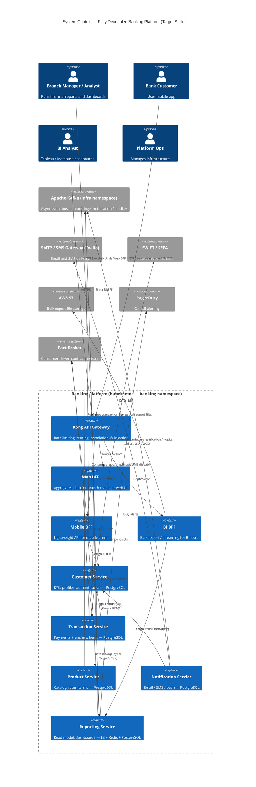

---

## 6. Kafka Event Topology

### Topic Families

| Topic Family | Publisher | Consumers | Partitions | Key |
|---|---|---|---|---|
| `reporting.transaction-created` | Transaction Service | Reporting Service | 6 | `clientId` |
| `reporting.loan-disbursed` | Transaction Service | Reporting Service | 6 | `clientId` |
| `reporting.transaction-reversed` | Transaction Service | Reporting Service | 6 | `clientId` |
| `reporting.product-rate-updated` | Product Service | Reporting Service | 6 | `clientId` |
| `reporting.chargeback-processed` | Transaction Service | Reporting Service | 6 | `clientId` |
| `reporting.dlq` | Reporting consumers (after 3 retries) | Ops monitoring | 3 | `clientId` |
| `notification.loan-approved` | Transaction Service | Notification Service | 3 | `clientId` |
| `notification.payment-confirmed` | Transaction Service | Notification Service | 3 | `clientId` |
| `notification.failed` | Notification Service | Transaction Service | 3 | `loanId` |
| `audit.*` | All services | Audit log consumer | 3 | `entityId` |

### Consumer Group Configuration

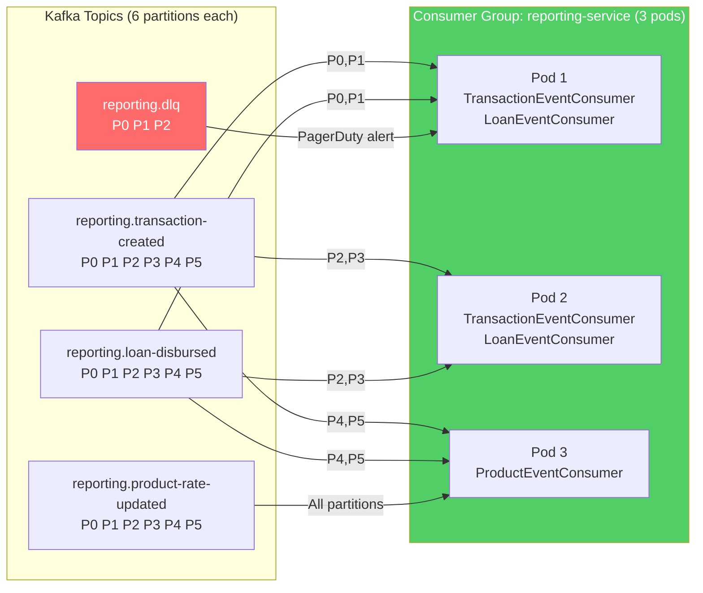

### DLQ Strategy

Every Kafka consumer is configured with `SeekToCurrentErrorHandler` and a `DeadLetterPublishingRecoverer`. After 3 failed processing attempts (with exponential backoff: 1 s, 2 s, 4 s), the message is published to `reporting.dlq` with the original headers preserved plus `X-Exception-Message` and `X-Original-Topic` headers. A dedicated Prometheus alert fires when DLQ lag exceeds zero, routing to PagerDuty on-call.

---

## 7. Data Store Ownership Map

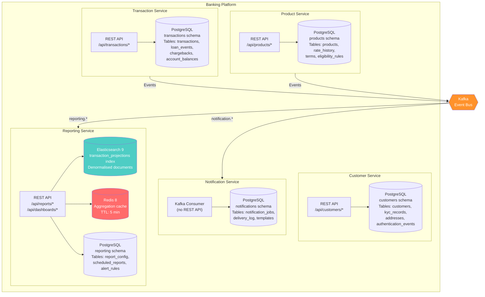

**Access rules enforced by convention + Pact contracts:**

- No service may hold a connection string to another service's database.
- Cross-service data access uses published events (async) or explicit REST APIs (sync, read-only lookups).
- Schema changes require a Pact contract update and provider verification before merge.

---

## 8. Deployment Topology

All services run as Kubernetes `Deployment` objects in the `banking` namespace. Stateful infrastructure (Kafka, Elasticsearch, Redis, PostgreSQL) runs as `StatefulSet` objects in the `infra` namespace.

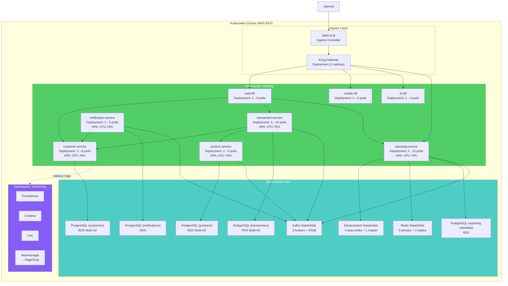

**PodDisruptionBudget:** Every `Deployment` has `minAvailable: 2`, ensuring at least 2 pods remain running during node drains or rolling updates.

**CI/CD Pipeline (7 stages, GitHub Actions):**

| Stage | What runs |
|---|---|
| 1 — Code Quality | Checkstyle, SpotBugs, OWASP dependency-check |
| 2 — Unit Tests | JUnit 5 + Mockito; Jacoco coverage gate ≥ 80% |
| 3 — Integration Tests | Testcontainers (Kafka, ES, Redis, PostgreSQL) |
| 4 — Build | `mvn package` + multi-stage Docker build |
| 5 — Security Scan | Trivy image scan; CRITICAL CVE = build fail |
| 6 — Push | Push to GHCR; tag = `git-sha + semver` |
| 7 — Deploy + Smoke | `helm upgrade --atomic`; smoke tests via `curl`; Argo Rollouts canary analysis |

---

## 9. Pattern Reference Index

Complete cross-reference: all 18 patterns, where each is implemented, and the section that details it.

| # | Pattern | Primary Component(s) | Section |
|---|---|---|---|
| 1 | **API Gateway** | Kong (DB-less, rate limiting, correlation-ID) | [4.1](#41-api-gateway--bff-layer) |
| 2 | **BFF** | Web BFF, Mobile BFF, BI BFF | [4.1](#41-api-gateway--bff-layer) |
| 3 | **Service Discovery** | Kubernetes DNS — no Eureka | [4.2](#42-service-discovery) |
| 4 | **Circuit Breaker** | Resilience4j on Feign clients + Elasticsearch | [4.7](#47-resilience-patterns-circuit-breaker-bulkhead-retry) |
| 5 | **Bulkhead** | Resilience4j thread pool isolation (ES: 20, Kafka: separate groups) | [4.7](#47-resilience-patterns-circuit-breaker-bulkhead-retry) |
| 6 | **Retry** | Resilience4j exponential backoff 1 s → 2 s → 4 s | [4.7](#47-resilience-patterns-circuit-breaker-bulkhead-retry) |
| 7 | **Saga (Choreography)** | Loan disbursement via Kafka events + compensating events | [4.6](#46-saga-pattern--distributed-transactions) |
| 8 | **Event Sourcing** | Kafka topics as append-only log; ES projections rebuilt from offset 0 | [4.5](#45-cqrs--event-sourcing-reporting-service-deep-dive) |
| 9 | **CQRS** | Command: PostgreSQL in Tx/Prod/Customer; Query: ES in Reporting | [4.5](#45-cqrs--event-sourcing-reporting-service-deep-dive) |
| 10 | **Database per Service** | Five isolated PostgreSQL schemas; no cross-service table access | [4.3](#43-domain-services--database-per-service) |
| 11 | **Data Sharding** | Kafka partition key = `clientId`; ES routing = `clientId` | [4.8](#48-data-sharding) |
| 12 | **Sidecar** | JMX Exporter + Fluent Bit on every pod | [4.9](#49-sidecar-pattern-observability) |
| 13 | **Smart Endpoints, Dumb Pipes** | Kafka as pure transport; business logic in consumer services | [4.4](#44-event-driven-architecture--smart-endpoints-dumb-pipes) |
| 14 | **Event-Driven Architecture** | All write-path state changes via Kafka; no sync calls for mutations | [4.4](#44-event-driven-architecture--smart-endpoints-dumb-pipes) |
| 15 | **Consumer-Driven Contracts** | Pact broker; Reporting publishes contracts; Transaction verifies on CI | [4.10](#410-consumer-driven-contracts) |
| 16 | **Strangler Fig** | Nginx routing + Redis feature flags per `clientId`; 5→20→50→100% | [4.11](#411-strangler-fig-migration-history) |
| 17 | **Shadow Deployment** | Nginx `mirror` directive; 10% of prod traffic mirrored to candidate | [4.12](#412-shadow-deployment) |
| 18 | **Stateless Services** | No pod-local state; Redis (cache), Kafka (offsets), S3 (files) | [4.13](#413-stateless-services) |

---

*This document reflects the complete target-state architecture of the fully decoupled banking platform. It is intended as interview preparation material demonstrating senior-level system design, distributed systems patterns, and production engineering judgment.*
