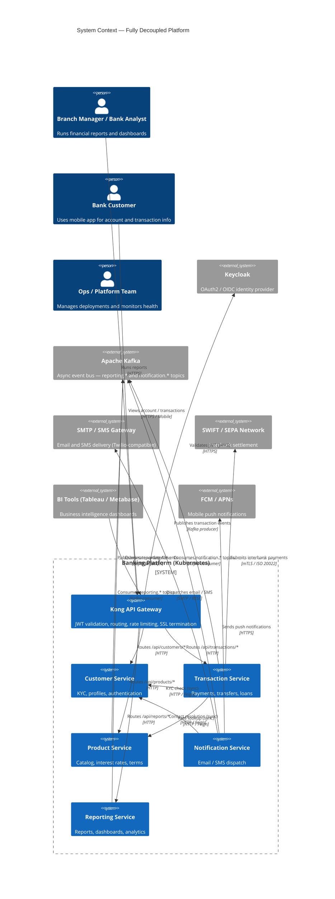
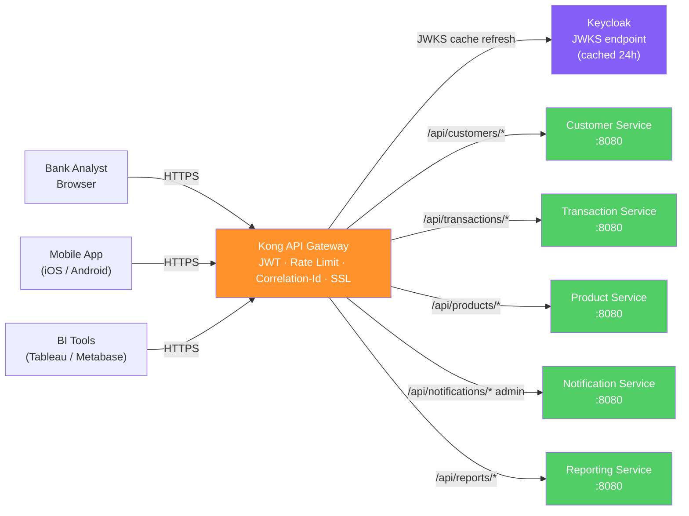
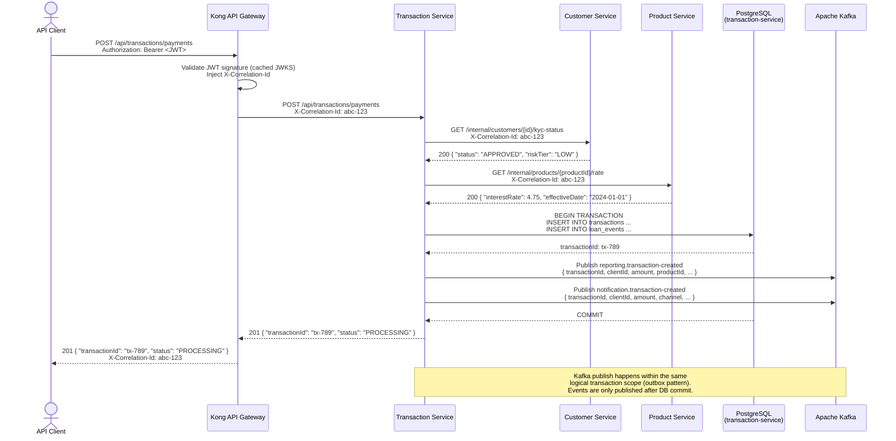
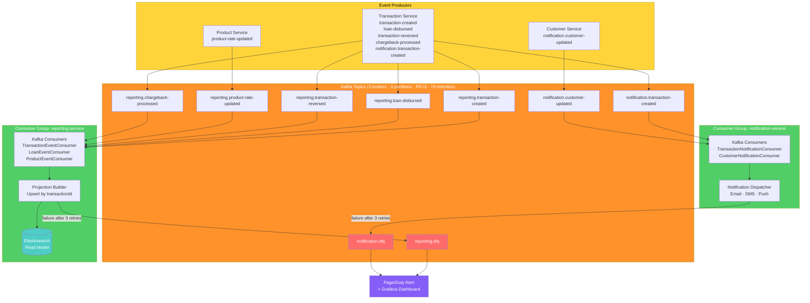
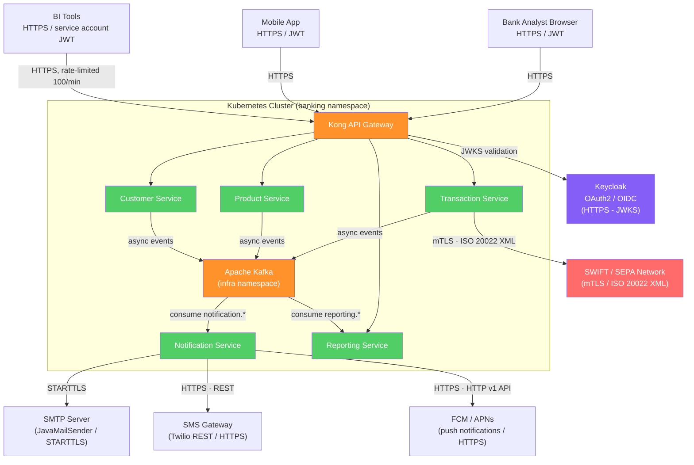
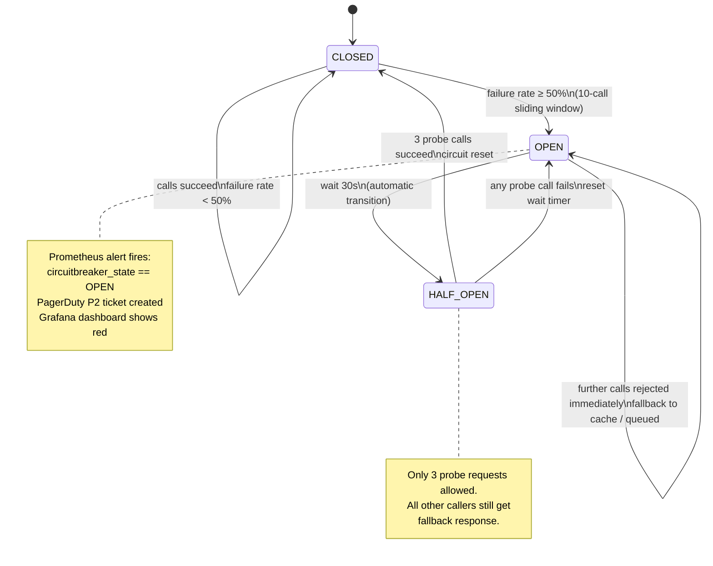
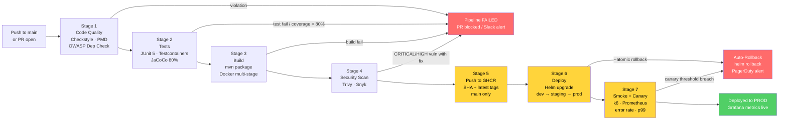
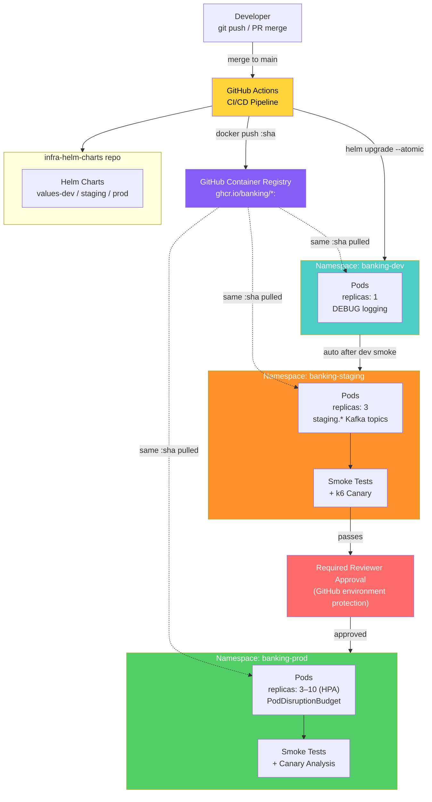

# Banking Platform: Communication & CI/CD

> **Interview Preparation — STAR Method Companion**
> Full-Platform Decoupling: Inter-Service Communication & Deployment Pipeline

---

## Table of Contents

**Part 1 — Inter-Service Communication**

1. [Platform Overview](#1-platform-overview)
2. [2.1 API Gateway (Kong)](#21-api-gateway-kong)
3. [2.2 Synchronous REST (Service-to-Service)](#22-synchronous-rest-service-to-service)
4. [2.3 gRPC Consideration](#23-grpc-consideration)
5. [2.4 Asynchronous Kafka Event Bus](#24-asynchronous-kafka-event-bus)
6. [2.5 Kafka Topics by Domain](#25-kafka-topics-by-domain)
7. [2.6 External Service Integrations](#26-external-service-integrations)
8. [2.7 Service Discovery (Kubernetes-Native)](#27-service-discovery-kubernetes-native)
9. [2.8 Resilience Patterns](#28-resilience-patterns)
10. [2.9 Error Handling & DLQ Strategy](#29-error-handling--dlq-strategy)

**Part 2 — CI/CD Pipeline**

11. [3.1 Repository & Branch Strategy](#31-repository--branch-strategy)
12. [3.2 Pipeline Architecture Overview](#32-pipeline-architecture-overview)
13. [3.3 Stage 1 — Code Quality](#33-stage-1--code-quality)
14. [3.4 Stage 2 — Unit & Integration Tests](#34-stage-2--unit--integration-tests)
15. [3.5 Stage 3 — Build (Maven + Docker)](#35-stage-3--build-maven--docker)
16. [3.6 Stage 4 — Security Scanning](#36-stage-4--security-scanning)
17. [3.7 Stage 5 — Push to GHCR](#37-stage-5--push-to-ghcr)
18. [3.8 Stage 6 — Deploy (Helm Upgrade)](#38-stage-6--deploy-helm-upgrade)
19. [3.9 Stage 7 — Smoke Tests & Canary Analysis](#39-stage-7--smoke-tests--canary-analysis)
20. [3.10 Environment Strategy](#310-environment-strategy)
21. [3.11 Rollback Strategy](#311-rollback-strategy)
22. [3.12 Secrets Management](#312-secrets-management)

**Appendix**

23. [Key Design Decisions](#4-appendix--key-design-decisions)

---

## 1. Platform Overview

Completing the decoupling journey begun with the Reporting microservice, the engineering team extended the Strangler Fig pattern across all five remaining monolith modules. Each domain now owns its data store, its deployment lifecycle, and its API contract. The shared PostgreSQL schema is gone. There are no cross-service JPA repositories. The platform has moved from a single deployable WAR with a monthly release cadence to five independently deployable Spring Boot 3.x services deployed daily.

This document covers how those five services talk to each other, how they talk to the outside world, and how every code change travels from a developer's laptop to production safely and repeatably.

### Technology Stack

| Layer | Technology |
|---|---|
| Language | Java 17 |
| Framework | Spring Boot 3.x |
| API Gateway | Kong (declarative config, DB-less mode) |
| Auth | Keycloak 22 — OAuth2 / JWT (OIDC) |
| Sync Communication | REST via Spring `@FeignClient` |
| Async Messaging | Apache Kafka 3.x (Spring Kafka) |
| Service Discovery | Kubernetes DNS (no Eureka / Consul) |
| Resilience | Resilience4j 2.x (Circuit Breaker, Retry, Rate Limiter, Bulkhead) |
| Containerization | Docker (multi-stage builds) + Kubernetes |
| Package Management | Helm 3 (centralized chart repository) |
| CI/CD | GitHub Actions |
| Container Registry | GitHub Container Registry (GHCR) |
| Observability | Prometheus + Grafana + Loki + PagerDuty |
| Secret Management | Kubernetes Secrets (KMS-encrypted at rest) |

### Services Summary

| Service | Responsibility | Data Store(s) | Consumed By |
|---|---|---|---|
| Customer Service | KYC, profiles, authentication | PostgreSQL (own schema) | Transaction Service, Notification Service |
| Transaction Service | Payments, transfers, loans | PostgreSQL (own schema) | Reporting Service (via Kafka) |
| Product Service | Catalog, interest rates, terms | PostgreSQL (own schema) | Transaction Service, Reporting Service (via Kafka) |
| Notification Service | Email / SMS dispatch | PostgreSQL (job log) | Triggered by Kafka events |
| Reporting Service | Financial reports, dashboards, analytics | Elasticsearch + Redis + PostgreSQL | Bank analysts, BI tools, Mobile app |

### System Context Diagram



> **Note:** Kong is the single ingress point for all external traffic. Service-to-service calls inside the cluster travel over Kubernetes DNS — they never re-enter Kong. Kafka sits logically outside the platform boundary because it is a shared infrastructure component; in practice it runs as a StatefulSet in the `infra` namespace.

---

## 2.1 API Gateway (Kong)

Kong operates in DB-less declarative mode — the full gateway configuration lives in a `kong.yaml` file versioned in the `infra-helm-charts` repository, applied via the Helm chart on every deployment.

### Routing Table

| Path Prefix | Upstream Service | Internal DNS |
|---|---|---|
| `/api/customers/*` | Customer Service | `customer-service.banking.svc.cluster.local:8080` |
| `/api/transactions/*` | Transaction Service | `transaction-service.banking.svc.cluster.local:8080` |
| `/api/products/*` | Product Service | `product-service.banking.svc.cluster.local:8080` |
| `/api/reports/*` | Reporting Service | `reporting-service.banking.svc.cluster.local:8080` |
| `/api/notifications/*` | Notification Service (admin only) | `notification-service.banking.svc.cluster.local:8080` |

### Kong Responsibilities

- **JWT validation**: Validates RS256 bearer tokens against Keycloak's JWKS endpoint. Public keys are cached locally (24-hour TTL) — no per-request roundtrip to Keycloak for the hot path.
- **Rate limiting**: Per-consumer sliding-window limits enforced at the gateway before requests reach services.
- **SSL termination**: TLS 1.3 terminated at Kong; inter-cluster traffic is HTTP.
- **`X-Correlation-Id` injection**: If the incoming request carries no `X-Correlation-Id` header, Kong generates a UUID v4 and injects it before forwarding. All downstream services propagate it.
- **Request / response logging**: Access logs emitted to stdout, scraped by Loki.

### Kong ↔ Keycloak JWKS Integration

Kong's `jwt` plugin is configured with Keycloak's JWKS URI (`/realms/banking/protocol/openid-connect/certs`). On startup and on a 24-hour cache-refresh timer, Kong fetches the public key set and stores it in memory. JWT signatures are verified locally — there is no synchronous call to Keycloak on the hot path. If a token's `kid` header is not found in the cached key set, Kong performs an eager refresh before rejecting.

### Kong Declarative Config (excerpt)

```yaml
# kong.yaml — DB-less declarative configuration
_format_version: "3.0"

services:
  - name: customer-service
    url: http://customer-service.banking.svc.cluster.local:8080
    routes:
      - name: customer-routes
        paths: ["/api/customers"]
        strip_path: false
    plugins:
      - name: jwt
        config:
          key_claim_name: kid
          claims_to_verify: [exp]
      - name: rate-limiting
        config:
          minute: 300
          policy: local
      - name: correlation-id
        config:
          header_name: X-Correlation-Id
          generator: uuid#counter
          echo_downstream: true

  - name: transaction-service
    url: http://transaction-service.banking.svc.cluster.local:8080
    routes:
      - name: transaction-routes
        paths: ["/api/transactions"]
        strip_path: false
    plugins:
      - name: jwt
        config:
          key_claim_name: kid
          claims_to_verify: [exp]
      - name: rate-limiting
        config:
          minute: 600
          policy: local

  - name: reporting-service
    url: http://reporting-service.banking.svc.cluster.local:8080
    routes:
      - name: reporting-routes
        paths: ["/api/reports"]
        strip_path: false
    plugins:
      - name: jwt
        config:
          key_claim_name: kid
          claims_to_verify: [exp]
      - name: rate-limiting
        config:
          minute: 100   # BI service accounts hit this endpoint
          policy: local
```

### API Gateway Topology



> **Note:** All services behind Kong are `ClusterIP` services — they have no external ingress of their own. The only way into the cluster from outside is through Kong. Service-to-service calls bypass Kong entirely and travel directly over Kubernetes DNS.

---

## 2.2 Synchronous REST (Service-to-Service)

Three internal REST calls exist in the fully-decoupled platform. These are synchronous, blocking calls for data that must be consistent at request time.

| Caller | Callee | Purpose | Endpoint |
|---|---|---|---|
| Transaction Service | Customer Service | KYC status check before processing payment | `GET /internal/customers/{customerId}/kyc-status` |
| Transaction Service | Product Service | Fetch current interest rate for loan product | `GET /internal/products/{productId}/rate` |
| Notification Service | Customer Service | Resolve contact details (email, phone) for a customer | `GET /internal/customers/{customerId}/contact` |

All internal endpoints are prefixed with `/internal/` and are **not** exposed via Kong. They are only reachable within the cluster on `ClusterIP` addresses.

### Internal DNS Addresses

```
http://customer-service.banking.svc.cluster.local:8080
http://transaction-service.banking.svc.cluster.local:8080
http://product-service.banking.svc.cluster.local:8080
http://notification-service.banking.svc.cluster.local:8080
http://reporting-service.banking.svc.cluster.local:8080
```

### Spring `@FeignClient` with Correlation ID Propagation

```java
// In transaction-service: client interface for Customer Service
@FeignClient(
    name = "customer-service",
    url = "${services.customer-service.url}",
    configuration = InternalFeignConfig.class
)
public interface CustomerServiceClient {

    @GetMapping("/internal/customers/{customerId}/kyc-status")
    KycStatusResponse getKycStatus(@PathVariable String customerId);
}
```

```java
// Feign request interceptor — propagates X-Correlation-Id on every outbound call
@Configuration
public class InternalFeignConfig {

    @Bean
    public RequestInterceptor correlationIdInterceptor() {
        return requestTemplate -> {
            String correlationId = MDC.get("correlationId");
            if (correlationId != null) {
                requestTemplate.header("X-Correlation-Id", correlationId);
            }
        };
    }
}
```

```java
// Spring Security filter — extracts X-Correlation-Id from inbound request and seeds MDC
@Component
@Order(Ordered.HIGHEST_PRECEDENCE)
public class CorrelationIdFilter extends OncePerRequestFilter {

    @Override
    protected void doFilterInternal(HttpServletRequest request,
                                    HttpServletResponse response,
                                    FilterChain chain) throws ServletException, IOException {
        String correlationId = request.getHeader("X-Correlation-Id");
        if (correlationId == null || correlationId.isBlank()) {
            correlationId = UUID.randomUUID().toString();
        }
        MDC.put("correlationId", correlationId);
        response.setHeader("X-Correlation-Id", correlationId);
        try {
            chain.doFilter(request, response);
        } finally {
            MDC.remove("correlationId");
        }
    }
}
```

### `application.yaml` — Service URL Configuration

```yaml
# transaction-service/src/main/resources/application.yaml
services:
  customer-service:
    url: ${CUSTOMER_SERVICE_URL:http://customer-service.banking.svc.cluster.local:8080}
  product-service:
    url: ${PRODUCT_SERVICE_URL:http://product-service.banking.svc.cluster.local:8080}

feign:
  client:
    config:
      default:
        connectTimeout: 2000
        readTimeout: 5000
        loggerLevel: BASIC
```

URLs are injected via environment variables in each Kubernetes Deployment (sourced from a ConfigMap), with the Kubernetes DNS address as the default fallback for local development.

### Transaction Booking Flow



> **Note:** The KYC check and rate lookup are synchronous because they are required for the booking decision — a transaction cannot proceed without a valid KYC status or a current interest rate. Everything downstream (reporting projection, customer notification) is asynchronous via Kafka.

---

## 2.3 gRPC Consideration

During the design phase, the team evaluated replacing the Transaction→Product REST call with gRPC. The Product Service's rate lookup is the highest-frequency internal call: at peak load (end-of-month batch processing), Transaction Service issues approximately 400 requests/second against the Product Service.

**Arguments for gRPC:**
- Binary Protocol Buffers serialization is ~3–5× faster than JSON for small, structured payloads
- Strongly-typed contracts enforced at compile time (no schema drift)
- HTTP/2 multiplexing reduces connection overhead at high call rates

**Why REST was retained:**
- Internal p99 latency for the rate lookup was measured at 8–12ms over REST — well within the 50ms budget for the synchronous booking path
- gRPC adds operational complexity: Kubernetes health checks require gRPC-specific probes, Feign is replaced by a generated stub, and debugging binary traffic is harder
- The team's familiarity with Feign and Spring MVC observability tooling (Micrometer, Actuator) was a practical consideration
- Kong's gRPC transcoding support in DB-less mode had known limitations at the time of evaluation

> **Note:** The decision to revisit gRPC is documented as a backlog item, triggered when Transaction Service throughput sustained above 500 TPS — the point at which the REST overhead becomes measurable in end-to-end SLO budgets.

---

## 2.4 Asynchronous Kafka Event Bus

All events that cross domain boundaries without requiring a synchronous response travel over Kafka. This covers two consumer patterns:

- **Reporting Service**: builds denormalized Elasticsearch projections from financial events
- **Notification Service**: dispatches email/SMS/push in response to transaction and customer lifecycle events

### Why Kafka

| Benefit | Detail |
|---|---|
| Temporal decoupling | Transaction Service's `processPayment()` completes immediately regardless of Reporting or Notification availability |
| Event replay | Consumer offsets can be reset to replay historical events for backfill, incident recovery, or new consumer onboarding |
| Fan-out | A single `reporting.transaction-created` event is consumed independently by Reporting and — via a separate topic — by Notification |
| Audit log | Kafka topics with 7-day retention serve as an immutable ordered log of all financial events |
| Per-client ordering | `clientId` partition key ensures all events for a given client are processed in order within a partition |

### Kafka Cluster Configuration

| Parameter | Value |
|---|---|
| Brokers | 3 (StatefulSet in `infra` namespace) |
| Partitions per topic | 3 |
| Replication factor | 3 |
| Partition key | `clientId` |
| Retention | 7 days |
| Compression | `lz4` |
| Consumer group | `reporting-service` (Reporting), `notification-service` (Notification) |
| Idempotency | All consumers use upsert semantics keyed by `transactionId` |

### Full Producer / Consumer Table

| Topic | Producer(s) | Consumer(s) | Purpose |
|---|---|---|---|
| `reporting.transaction-created` | Transaction Service | Reporting Service | Build transaction projection in ES |
| `reporting.loan-disbursed` | Transaction Service | Reporting Service | Enrich projection with loan data |
| `reporting.transaction-reversed` | Transaction Service | Reporting Service | Mark projection as REVERSED |
| `reporting.product-rate-updated` | Product Service | Reporting Service | Refresh rate data on existing projections |
| `reporting.chargeback-processed` | Transaction Service | Reporting Service | Record chargeback on projection |
| `reporting.dlq` | Reporting Service (error path) | Ops / PagerDuty alert | Dead-letter events from Reporting consumer |
| `notification.transaction-created` | Transaction Service | Notification Service | Trigger payment confirmation email/SMS |
| `notification.customer-updated` | Customer Service | Notification Service | Trigger KYC / profile change notification |
| `notification.dlq` | Notification Service (error path) | Ops / PagerDuty alert | Dead-letter events from Notification consumer |

### Full Kafka Event Flow



> **Note:** `notification.*` topics are intentionally separate from `reporting.*` topics. This allows each consumer group to scale, replay, and fail independently. A DLQ overflow in Notification Service does not affect Reporting Service offset progress.

---

## 2.5 Kafka Topics by Domain

### `reporting.transaction-created`

| Attribute | Value |
|---|---|
| Partition key | `clientId` |
| Producers | Transaction Service |
| Consumers | Reporting Service |
| Retention | 7 days |

```json
{
  "eventType": "TransactionCreated",
  "schemaVersion": "1.0",
  "transactionId": "tx-789",
  "clientId": "cli-001",
  "correlationId": "abc-123",
  "amount": 15000.00,
  "currency": "EUR",
  "productId": "prod-mortgage-01",
  "productType": "MORTGAGE",
  "occurredAt": "2024-01-15T10:30:00Z"
}
```

---

### `reporting.loan-disbursed`

| Attribute | Value |
|---|---|
| Partition key | `clientId` |
| Producers | Transaction Service |
| Consumers | Reporting Service |

```json
{
  "eventType": "LoanDisbursed",
  "schemaVersion": "1.0",
  "transactionId": "tx-789",
  "loanId": "loan-456",
  "clientId": "cli-001",
  "correlationId": "abc-123",
  "amount": 15000.00,
  "currency": "EUR",
  "status": "DISBURSED",
  "occurredAt": "2024-01-15T10:30:05Z"
}
```

---

### `reporting.transaction-reversed`

| Attribute | Value |
|---|---|
| Partition key | `clientId` |
| Producers | Transaction Service |
| Consumers | Reporting Service |

```json
{
  "eventType": "TransactionReversed",
  "schemaVersion": "1.0",
  "transactionId": "tx-789",
  "clientId": "cli-001",
  "correlationId": "abc-123",
  "reason": "DUPLICATE_PAYMENT",
  "occurredAt": "2024-01-15T11:00:00Z"
}
```

---

### `reporting.product-rate-updated`

| Attribute | Value |
|---|---|
| Partition key | `productId` |
| Producers | Product Service |
| Consumers | Reporting Service |

```json
{
  "eventType": "ProductRateUpdated",
  "schemaVersion": "1.0",
  "productId": "prod-mortgage-01",
  "correlationId": "abc-456",
  "previousRate": 4.50,
  "newRate": 4.75,
  "effectiveDate": "2024-02-01",
  "occurredAt": "2024-01-20T08:00:00Z"
}
```

---

### `reporting.chargeback-processed`

| Attribute | Value |
|---|---|
| Partition key | `clientId` |
| Producers | Transaction Service |
| Consumers | Reporting Service |

```json
{
  "eventType": "ChargebackProcessed",
  "schemaVersion": "1.0",
  "loanId": "loan-456",
  "transactionId": "tx-789",
  "clientId": "cli-001",
  "correlationId": "abc-789",
  "amount": 15000.00,
  "occurredAt": "2024-01-18T14:00:00Z"
}
```

---

### `notification.transaction-created`

| Attribute | Value |
|---|---|
| Partition key | `clientId` |
| Producers | Transaction Service |
| Consumers | Notification Service |

```json
{
  "eventType": "TransactionCreated",
  "schemaVersion": "1.0",
  "transactionId": "tx-789",
  "clientId": "cli-001",
  "correlationId": "abc-123",
  "amount": 15000.00,
  "currency": "EUR",
  "channel": "EMAIL_AND_SMS",
  "occurredAt": "2024-01-15T10:30:00Z"
}
```

---

### `notification.customer-updated`

| Attribute | Value |
|---|---|
| Partition key | `clientId` |
| Producers | Customer Service |
| Consumers | Notification Service |

```json
{
  "eventType": "CustomerUpdated",
  "schemaVersion": "1.0",
  "clientId": "cli-001",
  "correlationId": "def-456",
  "changeType": "KYC_APPROVED",
  "occurredAt": "2024-01-16T09:15:00Z"
}
```

---

### `reporting.dlq` / `notification.dlq` — DLQ Envelope Format

All dead-letter events are wrapped in a standard envelope:

```json
{
  "originalTopic": "reporting.transaction-created",
  "originalPayload": { "...": "original event body" },
  "failureReason": "ElasticsearchStatusException: index not found",
  "failedAt": "2024-01-15T10:31:45Z",
  "attemptCount": 3,
  "consumerGroup": "reporting-service",
  "correlationId": "abc-123"
}
```

---

## 2.6 External Service Integrations

### Keycloak (Identity Provider)

Keycloak is the authoritative OAuth2 / OIDC identity provider for the platform. It issues JWT access tokens signed with RS256.

- **Token flow**: Clients (browser, mobile app, BI tools) authenticate against Keycloak's `/realms/banking/protocol/openid-connect/token` endpoint and receive a JWT. This JWT is presented as a `Bearer` token on every API call to Kong.
- **JWKS caching**: Kong and each Spring Boot service both cache the Keycloak public key set. Services use `spring-boot-starter-oauth2-resource-server` with `spring.security.oauth2.resourceserver.jwt.jwk-set-uri` pointing to Keycloak's JWKS endpoint. The Spring Security key resolver caches keys for 5 minutes by default.
- **Service accounts**: Internal CI/CD pipelines and BI tools use Keycloak service accounts with scoped roles (`ROLE_BI_SERVICE`, `ROLE_INTERNAL_SERVICE`) rather than user credentials.

```yaml
# application.yaml — resource server config (same across all services)
spring:
  security:
    oauth2:
      resourceserver:
        jwt:
          jwk-set-uri: ${KEYCLOAK_JWKS_URI:http://keycloak.infra.svc.cluster.local:8080/realms/banking/protocol/openid-connect/certs}
```

### SMTP / SMS Gateway (Notification Service)

The Notification Service is the **sole producer** of outbound customer communications. No other service calls SMTP or SMS directly.

- Email dispatch via Spring's `JavaMailSender` — SMTP credentials injected from Kubernetes Secret
- SMS dispatch via a Twilio-compatible REST API — `RestTemplate` with Resilience4j `RateLimiter` (100 SMS/min) and `Retry` (3 attempts, 2s exponential backoff)
- Push notifications via FCM/APNs HTTP v1 API for mobile customers

```java
@Service
public class SmsDispatchService {

    private final RestTemplate smsRestTemplate;

    @RateLimiter(name = "sms-gateway")
    @Retry(name = "sms-gateway")
    public void sendSms(String phoneNumber, String message) {
        SmsRequest request = new SmsRequest(phoneNumber, message);
        smsRestTemplate.postForObject(smsGatewayUrl + "/messages", request, SmsResponse.class);
    }
}
```

### SWIFT / SEPA Network (Transaction Service)

The Transaction Service is the **sole integrator** with interbank settlement networks.

- Mutual TLS (`mTLS`): Transaction Service presents a client certificate signed by the bank's internal CA. The SWIFT/SEPA endpoint validates it. Certificate rotation is handled via Kubernetes Secrets + Helm upgrade (no code changes required).
- ISO 20022 XML message format — generated via JAXB-bound schema classes
- Circuit Breaker wraps every outbound SWIFT call; fallback enqueues the payment to a PostgreSQL retry table with a scheduled reprocessing job

```java
@Service
public class SwiftGatewayClient {

    @CircuitBreaker(name = "swift-gateway", fallbackMethod = "enqueueForRetry")
    @Retry(name = "swift-gateway")
    public SwiftAckResponse submitPayment(Iso20022PaymentMessage message) {
        return swiftRestTemplate.postForObject(swiftEndpointUrl, message, SwiftAckResponse.class);
    }

    private SwiftAckResponse enqueueForRetry(Iso20022PaymentMessage message, Exception ex) {
        log.warn("SWIFT gateway unavailable, enqueuing for retry: {}", ex.getMessage());
        pendingPaymentRepository.save(PendingPayment.fromMessage(message));
        return SwiftAckResponse.queued();
    }
}
```

### BI Tools (Tableau / Metabase)

BI tools access the Reporting Service API exclusively — they have no direct access to Elasticsearch.

- Authenticate with a Keycloak service account bearing `ROLE_BI_SERVICE`
- Kong enforces a rate limit of 100 req/min on BI service account tokens
- The Reporting Service checks for `ROLE_BI_SERVICE` on endpoints that return aggregate-level data, enforcing that BI tools cannot access individual customer PII

### Mobile App (iOS / Android)

- Same Kong JWT flow as browser clients
- Push notifications are dispatched by the Notification Service via FCM (Android) and APNs (iOS) — the mobile app registers a device token with the Notification Service on first login, stored in its PostgreSQL job log

### External Integration Map



> **Note:** SWIFT integration carries the highest security burden — mTLS certificates are stored in Kubernetes Secrets, rotated quarterly, and never logged or exposed in application-level responses. All SWIFT call payloads are written to a tamper-evident audit log in Transaction Service's PostgreSQL database.

---

## 2.7 Service Discovery (Kubernetes-Native)

The platform uses Kubernetes DNS for service discovery. There is no Eureka, no Consul, and no Istio. This was a deliberate choice to minimize operational surface area — five services running in a single cluster do not need a dedicated service mesh.

### How It Works

Every `Service` resource in Kubernetes automatically receives a DNS entry in the form `<service-name>.<namespace>.svc.cluster.local`. Any pod in the cluster can resolve this name to the `ClusterIP` of the target service. Kubernetes kube-proxy handles load balancing across healthy pods.

### Internal DNS Reference

| Service | Internal DNS | Port |
|---|---|---|
| Customer Service | `customer-service.banking.svc.cluster.local` | 8080 |
| Transaction Service | `transaction-service.banking.svc.cluster.local` | 8080 |
| Product Service | `product-service.banking.svc.cluster.local` | 8080 |
| Notification Service | `notification-service.banking.svc.cluster.local` | 8080 |
| Reporting Service | `reporting-service.banking.svc.cluster.local` | 8080 |
| Keycloak | `keycloak.infra.svc.cluster.local` | 8080 |
| Kafka Bootstrap | `kafka.infra.svc.cluster.local` | 9092 |
| Elasticsearch | `elasticsearch.infra.svc.cluster.local` | 9200 |
| Redis | `redis.infra.svc.cluster.local` | 6379 |

### ConfigMap-Injected Service URLs

Service URLs are not hardcoded. A ConfigMap per environment (dev / staging / prod) injects them as environment variables into each Deployment:

```yaml
# configmap-banking.yaml (applied per environment)
apiVersion: v1
kind: ConfigMap
metadata:
  name: service-urls
  namespace: banking
data:
  CUSTOMER_SERVICE_URL: "http://customer-service.banking.svc.cluster.local:8080"
  PRODUCT_SERVICE_URL: "http://product-service.banking.svc.cluster.local:8080"
  KEYCLOAK_JWKS_URI: "http://keycloak.infra.svc.cluster.local:8080/realms/banking/protocol/openid-connect/certs"
  KAFKA_BOOTSTRAP_SERVERS: "kafka.infra.svc.cluster.local:9092"
  ELASTICSEARCH_URIS: "http://elasticsearch.infra.svc.cluster.local:9200"
  REDIS_HOST: "redis.infra.svc.cluster.local"
```

> **Note:** Istio is documented as the future path if mTLS compliance becomes a regulatory requirement. The migration would be transparent to application code — Istio's sidecar proxy handles mTLS at the network layer, requiring no changes to Feign clients or Spring Security config. The Helm charts already include commented `PeerAuthentication` and `DestinationRule` stanzas ready to activate.

---

## 2.8 Resilience Patterns

Every inter-service call — both synchronous REST and external integrations — is wrapped in one or more Resilience4j patterns. The goal is to fail fast, degrade gracefully, and never let a slow downstream service cascade into a full platform outage.

### Pattern Summary

| Pattern | Scenario | Library | Configuration |
|---|---|---|---|
| Circuit Breaker | Transaction→Customer KYC, Transaction→SWIFT, Reporting→Elasticsearch | Resilience4j `@CircuitBreaker` | 50% failure threshold, 10-call sliding window, 30s wait in OPEN |
| Retry | All Feign client calls, SMS dispatch, SWIFT submission | Resilience4j `@Retry` | 3 attempts, exponential backoff (2s base, 2× multiplier) |
| Rate Limiter | SMS dispatch (100/min), outbound push (500/min) | Resilience4j `@RateLimiter` | Sliding window, 1s refresh period |
| Bulkhead | Elasticsearch query pool in Reporting Service | Resilience4j `@Bulkhead` (thread-pool) | 20 concurrent calls, queue depth 50 |
| Timeout | All Feign calls, Elasticsearch queries | Resilience4j `@TimeLimiter` + Feign `readTimeout` | 5s for internal REST, 3s for ES queries |
| DLQ | Kafka consumer failures after 3 retries | Spring Kafka `DeadLetterPublishingRecoverer` | `*.dlq` topic, exponential backoff 1s/2s/4s |

### Circuit Breaker + Retry on Feign Client

```java
@Service
public class KycCheckService {

    private final CustomerServiceClient customerServiceClient;
    private final RedisTemplate<String, KycStatusResponse> redisTemplate;

    @CircuitBreaker(name = "customer-service", fallbackMethod = "kycFromCache")
    @Retry(name = "customer-service")
    public KycStatusResponse getKycStatus(String customerId) {
        return customerServiceClient.getKycStatus(customerId);
    }

    // Fallback: return last known KYC status from Redis (TTL: 5 minutes)
    private KycStatusResponse kycFromCache(String customerId, Exception ex) {
        log.warn("Customer Service circuit open, falling back to cache for {}: {}",
                 customerId, ex.getMessage());
        KycStatusResponse cached = redisTemplate.opsForValue()
            .get("kyc:" + customerId);
        if (cached != null) {
            return cached;
        }
        // No cache — reject transaction with a retriable error
        throw new ServiceUnavailableException("KYC service unavailable, no cache available");
    }
}
```

### `application.yaml` — Resilience4j Configuration

```yaml
resilience4j:
  circuitbreaker:
    instances:
      customer-service:
        slidingWindowSize: 10
        failureRateThreshold: 50
        waitDurationInOpenState: 30s
        permittedNumberOfCallsInHalfOpenState: 3
        automaticTransitionFromOpenToHalfOpenEnabled: true
        registerHealthIndicator: true
      swift-gateway:
        slidingWindowSize: 5
        failureRateThreshold: 40
        waitDurationInOpenState: 60s
        permittedNumberOfCallsInHalfOpenState: 2

  retry:
    instances:
      customer-service:
        maxAttempts: 3
        waitDuration: 2s
        enableExponentialBackoff: true
        exponentialBackoffMultiplier: 2
        retryExceptions:
          - feign.FeignException.ServiceUnavailable
          - java.net.ConnectException
      sms-gateway:
        maxAttempts: 3
        waitDuration: 2s
        enableExponentialBackoff: true
        exponentialBackoffMultiplier: 2

  ratelimiter:
    instances:
      sms-gateway:
        limitForPeriod: 100
        limitRefreshPeriod: 1m
        timeoutDuration: 5s

  bulkhead:
    instances:
      elasticsearch:
        maxConcurrentCalls: 20
        maxWaitDuration: 100ms
```

### Circuit Breaker State Machine



> **Note:** All circuit breaker state transitions emit Micrometer metrics (`resilience4j.circuitbreaker.state`) which are scraped by Prometheus. A Grafana alert fires within 60 seconds of a circuit opening and creates a P2 incident in PagerDuty. The on-call engineer can inspect the circuit state via Spring Boot Actuator: `GET /actuator/health`.

---

## 2.9 Error Handling & DLQ Strategy

### REST Error Handling (RFC 7807)

All services return `application/problem+json` (RFC 7807) for error responses, implemented via a shared `@ControllerAdvice` in the `banking-commons` library:

```java
// banking-commons: shared error response structure
@RestControllerAdvice
public class GlobalExceptionHandler {

    @ExceptionHandler(ServiceUnavailableException.class)
    @ResponseStatus(HttpStatus.SERVICE_UNAVAILABLE)
    public ProblemDetail handleServiceUnavailable(ServiceUnavailableException ex,
                                                   HttpServletRequest request) {
        ProblemDetail problem = ProblemDetail.forStatus(HttpStatus.SERVICE_UNAVAILABLE);
        problem.setTitle("Service Temporarily Unavailable");
        problem.setDetail(ex.getMessage());
        problem.setInstance(URI.create(request.getRequestURI()));
        problem.setProperty("correlationId", MDC.get("correlationId"));
        problem.setProperty("timestamp", Instant.now());
        return problem;
    }

    @ExceptionHandler(ValidationException.class)
    @ResponseStatus(HttpStatus.UNPROCESSABLE_ENTITY)
    public ProblemDetail handleValidation(ValidationException ex, HttpServletRequest request) {
        ProblemDetail problem = ProblemDetail.forStatus(HttpStatus.UNPROCESSABLE_ENTITY);
        problem.setTitle("Validation Failed");
        problem.setDetail(ex.getMessage());
        problem.setInstance(URI.create(request.getRequestURI()));
        problem.setProperty("correlationId", MDC.get("correlationId"));
        problem.setProperty("violations", ex.getViolations());
        return problem;
    }
}
```

### Kafka DLQ Strategy

Kafka consumers use Spring Kafka's `DefaultErrorHandler` with a `DeadLetterPublishingRecoverer`:

```java
@Configuration
public class KafkaConsumerConfig {

    @Bean
    public DefaultErrorHandler errorHandler(KafkaTemplate<String, Object> kafkaTemplate) {
        DeadLetterPublishingRecoverer recoverer = new DeadLetterPublishingRecoverer(
            kafkaTemplate,
            (record, ex) -> new TopicPartition(record.topic() + ".dlq", record.partition())
        );

        ExponentialBackOffWithMaxRetries backOff = new ExponentialBackOffWithMaxRetries(3);
        backOff.setInitialInterval(1000);   // 1s
        backOff.setMultiplier(2.0);         // 1s → 2s → 4s
        backOff.setMaxInterval(10000);

        return new DefaultErrorHandler(recoverer, backOff);
    }
}
```

After 3 failed attempts (1s → 2s → 4s backoff), the consumer publishes the event to the `*.dlq` topic wrapped in the standard DLQ envelope (see §2.5).

### DLQ Monitoring

- Prometheus metric `kafka_consumer_records_lag_max` tracked per consumer group and topic
- Custom counter `kafka_consumer_dlq_total` incremented by the `DeadLetterPublishingRecoverer`
- Grafana alert: `kafka_consumer_dlq_total > 0` within a 5-minute window → PagerDuty P2
- DLQ events are retained for 7 days, giving the ops team time to investigate root cause and replay using a DLQ replay utility (`banking-commons` library provides a `DlqReplayService`)

### Correlation ID Propagation

The `X-Correlation-Id` UUID flows through every layer:

| Layer | Mechanism |
|---|---|
| External client → Kong | Kong generates UUID if absent |
| Kong → Service | HTTP header `X-Correlation-Id` |
| Service → Service (Feign) | `CorrelationIdFilter` populates MDC; `InternalFeignConfig` reads MDC and injects header |
| Service → Kafka event | `correlationId` field in event payload JSON envelope |
| Kafka event → Consumer | Consumer extracts `correlationId` from payload and seeds MDC |
| All log lines | Logback pattern includes `%X{correlationId}` — Loki can trace the full request path across services |

---

## 3.1 Repository & Branch Strategy

The platform uses a **polyrepo** structure. Each service and shared concern lives in its own repository with its own CI/CD pipeline, its own release cadence, and its own GitHub team permissions.

### Repository Structure

| Repository | Contents | Deploy Frequency |
|---|---|---|
| `banking/customer-service` | Customer Service Spring Boot app | Daily |
| `banking/transaction-service` | Transaction Service Spring Boot app | Daily |
| `banking/product-service` | Product Service Spring Boot app | Daily |
| `banking/notification-service` | Notification Service Spring Boot app | Daily |
| `banking/reporting-service` | Reporting Service Spring Boot app | Daily |
| `banking/banking-commons` | Shared library (error handling, Feign config, DLQ utilities) | On demand |
| `banking/infra-helm-charts` | All Helm charts, per-environment values, Kong config | On infra change |

### Branch Naming Conventions

| Branch Type | Pattern | Example |
|---|---|---|
| Feature | `feature/<JIRA-ID>-short-description` | `feature/PAY-1234-add-chargeback-endpoint` |
| Hotfix | `hotfix/<JIRA-ID>-short-description` | `hotfix/PAY-1238-fix-currency-rounding` |
| Main | `main` | Protected — no direct pushes |

### Trunk-Based Development

The team practices **Trunk-Based Development**. Feature branches are short-lived (maximum 2 days). Developers merge to `main` frequently via pull request. Long-running feature branches are avoided by using feature flags (Redis-backed, see §3.11) to hide incomplete work in production.

### Branch Protection Rules (`main`)

- All CI checks must pass (Stages 1–5 in the pipeline)
- Minimum 1 reviewer approval required
- No direct pushes — all changes via pull request
- `detect-secrets` pre-commit hook runs locally before any commit, and again as a CI step to catch secrets in committed code

```yaml
# .pre-commit-config.yaml (all repos)
repos:
  - repo: https://github.com/Yelp/detect-secrets
    rev: v1.4.0
    hooks:
      - id: detect-secrets
        args: ['--baseline', '.secrets.baseline']
```

---

## 3.2 Pipeline Architecture Overview

Every push to `main` triggers the full 7-stage pipeline. Pull request checks run Stages 1–4 only (no image push, no deploy). The philosophy is **fail fast**: if code quality or tests fail, the pipeline stops immediately rather than wasting build time.

### Pipeline Stage Summary

| Stage | Name | Tool | Typical Duration | Gate Type |
|---|---|---|---|---|
| 1 | Code Quality | Checkstyle, PMD, OWASP Dependency Check | ~3 min | Hard gate — any violation fails build |
| 2 | Unit & Integration Tests | JUnit 5, Testcontainers, JaCoCo | ~5 min | Hard gate — coverage < 80% or test failure fails build |
| 3 | Build | Maven `package`, Docker multi-stage build | ~4 min | Hard gate — compilation or Docker build failure |
| 4 | Security Scanning | Trivy (image), Snyk (source) | ~3 min | Hard gate — CRITICAL/HIGH with fix available |
| 5 | Push to GHCR | Docker push (SHA + `latest` tags) | ~2 min | `main` only — auto-skipped on PRs |
| 6 | Deploy | Helm upgrade (dev → staging → prod) | ~5 min per env | dev/staging auto; prod requires reviewer approval |
| 7 | Smoke Tests & Canary | k6 load test, Prometheus canary analysis | ~5 min | Auto-rollback via `helm rollback` on threshold breach |

Total pipeline: **dev deploy < 10 min** from `main` merge; **prod deploy < 20 min** (excluding manual approval wait time).

### CI/CD Pipeline Flow



> **Note:** Stages 5, 6, and 7 (yellow) only run on merges to `main`. Pull request pipelines run Stages 1–4 only. This keeps PR feedback fast (< 15 min) while ensuring the full deploy pipeline runs only on verified, reviewed code.

---

## 3.3 Stage 1 — Code Quality

```yaml
# .github/workflows/ci.yaml — Stage 1: Code Quality
name: CI Pipeline

on:
  push:
    branches: [main]
  pull_request:
    branches: [main]

jobs:
  code-quality:
    name: Code Quality
    runs-on: ubuntu-latest
    steps:
      - uses: actions/checkout@v4

      - name: Set up Java 17
        uses: actions/setup-java@v4
        with:
          java-version: '17'
          distribution: 'temurin'
          cache: maven

      - name: Detect secrets
        run: |
          pip install detect-secrets
          detect-secrets scan --baseline .secrets.baseline

      - name: Checkstyle
        run: mvn checkstyle:check --no-transfer-progress

      - name: PMD Static Analysis
        run: mvn pmd:check --no-transfer-progress

      - name: OWASP Dependency Check
        run: |
          mvn org.owasp:dependency-check-maven:check \
            -DfailBuildOnCVSS=7.0 \
            -DsuppressionFile=owasp-suppressions.xml \
            --no-transfer-progress
```

### `pom.xml` — Plugin Configuration

```xml
<plugin>
    <groupId>org.apache.maven.plugins</groupId>
    <artifactId>maven-checkstyle-plugin</artifactId>
    <version>3.3.0</version>
    <configuration>
        <configLocation>google_checks.xml</configLocation>
        <failsOnError>true</failsOnError>
        <violationSeverity>warning</violationSeverity>
    </configuration>
    <executions>
        <execution>
            <id>validate</id>
            <phase>validate</phase>
            <goals><goal>check</goal></goals>
        </execution>
    </executions>
</plugin>

<plugin>
    <groupId>org.apache.maven.plugins</groupId>
    <artifactId>maven-pmd-plugin</artifactId>
    <version>3.21.0</version>
    <configuration>
        <rulesets>
            <ruleset>/category/java/bestpractices.xml</ruleset>
            <ruleset>/category/java/errorprone.xml</ruleset>
            <ruleset>pmd-ruleset.xml</ruleset>
        </rulesets>
        <failOnViolation>true</failOnViolation>
        <printFailingErrors>true</printFailingErrors>
    </configuration>
</plugin>

<plugin>
    <groupId>org.owasp</groupId>
    <artifactId>dependency-check-maven</artifactId>
    <version>9.0.9</version>
    <configuration>
        <failBuildOnCVSS>7.0</failBuildOnCVSS>
        <formats>HTML,JSON</formats>
        <suppressionFile>owasp-suppressions.xml</suppressionFile>
    </configuration>
</plugin>
```

---

## 3.4 Stage 2 — Unit & Integration Tests

Each service has its own Testcontainers configuration. Integration tests spin up real infrastructure containers — no mocking of Kafka, PostgreSQL, or Elasticsearch. This catches serialization bugs, schema migration issues, and consumer offset behavior that unit tests cannot.

### Per-Service Container Matrix

| Service | Kafka | PostgreSQL | Elasticsearch | Redis | WireMock | Keycloak |
|---|---|---|---|---|---|---|
| Customer Service | — | ✓ | — | — | — | ✓ |
| Transaction Service | ✓ | ✓ | — | — | ✓ (Customer, Product) | ✓ |
| Product Service | ✓ | ✓ | — | — | — | ✓ |
| Notification Service | ✓ | ✓ | — | — | ✓ (Customer, SMTP) | ✓ |
| Reporting Service | ✓ | ✓ | ✓ | ✓ | — | ✓ |

### `@DynamicPropertySource` Base Class

```java
// banking-commons test support library
@SpringBootTest(webEnvironment = SpringBootTest.WebEnvironment.RANDOM_PORT)
@Testcontainers
public abstract class AbstractIntegrationTest {

    @Container
    static final PostgreSQLContainer<?> postgres =
        new PostgreSQLContainer<>("postgres:15-alpine");

    @Container
    static final KafkaContainer kafka =
        new KafkaContainer(DockerImageName.parse("confluentinc/cp-kafka:7.5.0"));

    @DynamicPropertySource
    static void registerProperties(DynamicPropertyRegistry registry) {
        registry.add("spring.datasource.url", postgres::getJdbcUrl);
        registry.add("spring.datasource.username", postgres::getUsername);
        registry.add("spring.datasource.password", postgres::getPassword);
        registry.add("spring.kafka.bootstrap-servers", kafka::getBootstrapServers);
    }
}
```

### JaCoCo Coverage Gate

```xml
<plugin>
    <groupId>org.jacoco</groupId>
    <artifactId>jacoco-maven-plugin</artifactId>
    <version>0.8.11</version>
    <executions>
        <execution>
            <id>prepare-agent</id>
            <goals><goal>prepare-agent</goal></goals>
        </execution>
        <execution>
            <id>check</id>
            <phase>verify</phase>
            <goals><goal>check</goal></goals>
            <configuration>
                <rules>
                    <rule>
                        <element>BUNDLE</element>
                        <limits>
                            <limit>
                                <counter>LINE</counter>
                                <value>COVEREDRATIO</value>
                                <minimum>0.80</minimum>
                            </limit>
                        </limits>
                    </rule>
                </rules>
            </configuration>
        </execution>
    </executions>
</plugin>
```

```yaml
# .github/workflows/ci.yaml — Stage 2: Tests
  test:
    name: Unit & Integration Tests
    runs-on: ubuntu-latest
    needs: code-quality
    steps:
      - uses: actions/checkout@v4

      - name: Set up Java 17
        uses: actions/setup-java@v4
        with:
          java-version: '17'
          distribution: 'temurin'
          cache: maven

      - name: Run tests with JaCoCo
        run: mvn verify --no-transfer-progress

      - name: Upload test report
        uses: actions/upload-artifact@v4
        if: always()
        with:
          name: test-results
          path: |
            target/surefire-reports/
            target/failsafe-reports/
            target/site/jacoco/

      - name: Publish test results
        uses: EnricoMi/publish-unit-test-result-action@v2
        if: always()
        with:
          files: target/surefire-reports/*.xml
```

---

## 3.5 Stage 3 — Build (Maven + Docker)

### Multi-Stage Dockerfile

```dockerfile
# Stage 1: Build
FROM eclipse-temurin:17-jdk-alpine AS builder
WORKDIR /workspace

COPY pom.xml .
COPY src ./src

RUN mvn package -DskipTests --no-transfer-progress

# Stage 2: Extract layered JAR
FROM eclipse-temurin:17-jdk-alpine AS extractor
WORKDIR /workspace
COPY --from=builder /workspace/target/*.jar app.jar
RUN java -Djarmode=layertools -jar app.jar extract

# Stage 3: Runtime image (minimal JRE)
FROM eclipse-temurin:17-jre-alpine
WORKDIR /app

# Non-root user for security
RUN addgroup -S spring && adduser -S spring -G spring
USER spring:spring

# Copy layered JAR contents (improves layer caching)
COPY --from=extractor /workspace/dependencies/ ./
COPY --from=extractor /workspace/spring-boot-loader/ ./
COPY --from=extractor /workspace/snapshot-dependencies/ ./
COPY --from=extractor /workspace/application/ ./

EXPOSE 8080

ENTRYPOINT ["java", \
  "-XX:+UseContainerSupport", \
  "-XX:MaxRAMPercentage=75.0", \
  "-Djava.security.egd=file:/dev/./urandom", \
  "org.springframework.boot.loader.launch.JarLauncher"]
```

Key choices:
- **Eclipse Temurin 17 JRE** (not JDK) in the final stage — smaller attack surface
- **Non-root `spring` user** — container cannot write to system directories
- **Layered JAR extraction** — dependencies layer is cached separately from application code, making subsequent builds 80% faster
- **`-XX:UseContainerSupport`** — JVM reads cgroup memory limits rather than host RAM

### GitHub Actions — Stage 3

```yaml
  build:
    name: Build & Docker Image
    runs-on: ubuntu-latest
    needs: test
    outputs:
      image-tag: ${{ steps.meta.outputs.version }}
    steps:
      - uses: actions/checkout@v4

      - name: Set up Java 17
        uses: actions/setup-java@v4
        with:
          java-version: '17'
          distribution: 'temurin'
          cache: maven

      - name: Build JAR
        run: mvn package -DskipTests --no-transfer-progress

      - name: Extract Git SHA
        id: meta
        run: echo "version=$(git rev-parse --short HEAD)" >> $GITHUB_OUTPUT

      - name: Set up Docker Buildx
        uses: docker/setup-buildx-action@v3

      - name: Build Docker image (no push)
        uses: docker/build-push-action@v5
        with:
          context: .
          push: false
          tags: |
            ghcr.io/banking/${{ github.event.repository.name }}:${{ steps.meta.outputs.version }}
            ghcr.io/banking/${{ github.event.repository.name }}:latest
          cache-from: type=gha
          cache-to: type=gha,mode=max
          outputs: type=docker,dest=/tmp/image.tar

      - name: Upload image artifact
        uses: actions/upload-artifact@v4
        with:
          name: docker-image
          path: /tmp/image.tar
```

---

## 3.6 Stage 4 — Security Scanning

### Scanning Policy

| Severity | Has Fix Available | Action |
|---|---|---|
| CRITICAL | Yes | Build fails immediately |
| HIGH | Yes | Build fails immediately |
| HIGH | No fix yet | Warning logged, backlog ticket created (auto via GitHub issue) |
| MEDIUM / LOW | Any | Warning logged, no gate |

### GitHub Actions — Stage 4

```yaml
  security-scan:
    name: Security Scanning
    runs-on: ubuntu-latest
    needs: build
    permissions:
      security-events: write
    steps:
      - uses: actions/checkout@v4

      - name: Download image artifact
        uses: actions/download-artifact@v4
        with:
          name: docker-image
          path: /tmp

      - name: Load Docker image
        run: docker load --input /tmp/image.tar

      - name: Trivy — container image scan
        uses: aquasecurity/trivy-action@master
        with:
          image-ref: ghcr.io/banking/${{ github.event.repository.name }}:${{ needs.build.outputs.image-tag }}
          format: sarif
          output: trivy-image.sarif
          severity: CRITICAL,HIGH
          exit-code: '1'
          ignore-unfixed: false

      - name: Trivy — filesystem scan (dependencies)
        uses: aquasecurity/trivy-action@master
        with:
          scan-type: fs
          scan-ref: .
          format: sarif
          output: trivy-fs.sarif
          severity: CRITICAL,HIGH
          exit-code: '1'

      - name: Snyk — Maven source scan
        uses: snyk/actions/maven@master
        env:
          SNYK_TOKEN: ${{ secrets.SNYK_TOKEN }}
        with:
          args: --severity-threshold=high --sarif-file-output=snyk.sarif

      - name: Upload SARIF to GitHub Advanced Security
        uses: github/codeql-action/upload-sarif@v3
        if: always()
        with:
          sarif_file: |
            trivy-image.sarif
            trivy-fs.sarif
            snyk.sarif
```

SARIF results are uploaded to the GitHub Advanced Security tab, giving developers inline annotations on pull requests when a dependency introduces a known CVE.

---

## 3.7 Stage 5 — Push to GHCR

This stage runs **only on merges to `main`** — pull requests do not push images. The same image SHA that was scanned in Stage 4 is pushed to GHCR without rebuilding.

```yaml
  push-image:
    name: Push to GHCR
    runs-on: ubuntu-latest
    needs: [build, security-scan]
    if: github.ref == 'refs/heads/main'
    permissions:
      contents: read
      packages: write
    steps:
      - name: Download image artifact
        uses: actions/download-artifact@v4
        with:
          name: docker-image
          path: /tmp

      - name: Load Docker image
        run: docker load --input /tmp/image.tar

      - name: Log in to GHCR
        uses: docker/login-action@v3
        with:
          registry: ghcr.io
          username: ${{ github.actor }}
          password: ${{ secrets.GITHUB_TOKEN }}

      - name: Push image to GHCR
        run: |
          docker push ghcr.io/banking/${{ github.event.repository.name }}:${{ needs.build.outputs.image-tag }}
          docker push ghcr.io/banking/${{ github.event.repository.name }}:latest
```

The `GITHUB_TOKEN` provides just-in-time `packages: write` permission for the duration of the workflow run — no long-lived registry credentials are stored.

---

## 3.8 Stage 6 — Deploy (Helm Upgrade)

### Helm Chart Structure

All Helm charts live in the centralized `infra-helm-charts` repository. Each service has a chart directory with shared templates and per-environment values files:

```
infra-helm-charts/
├── charts/
│   ├── customer-service/
│   │   ├── Chart.yaml
│   │   ├── templates/
│   │   │   ├── deployment.yaml
│   │   │   ├── service.yaml
│   │   │   ├── configmap.yaml
│   │   │   ├── hpa.yaml
│   │   │   └── pdb.yaml
│   │   ├── values.yaml              # defaults
│   │   ├── values-dev.yaml
│   │   ├── values-staging.yaml
│   │   └── values-prod.yaml
│   ├── transaction-service/
│   ├── product-service/
│   ├── notification-service/
│   └── reporting-service/
└── kong/
    ├── kong.yaml
    └── values-prod.yaml
```

### Per-Environment Configuration

| Parameter | dev | staging | prod |
|---|---|---|---|
| `replicaCount` | 1 | 3 | 3 |
| `resources.requests.cpu` | `100m` | `500m` | `500m` |
| `resources.requests.memory` | `256Mi` | `512Mi` | `512Mi` |
| `resources.limits.cpu` | `500m` | `2000m` | `2000m` |
| `resources.limits.memory` | `512Mi` | `1Gi` | `1Gi` |
| `autoscaling.enabled` | `false` | `true` | `true` |
| `autoscaling.maxReplicas` | N/A | `6` | `10` |
| `logging.level.root` | `DEBUG` | `INFO` | `INFO` |
| `kafka.topics` | `dev.*` | `staging.*` | `reporting.*` / `notification.*` |

### GitHub Actions — Stage 6

```yaml
  deploy-dev:
    name: Deploy to Dev
    runs-on: ubuntu-latest
    needs: push-image
    environment: development
    steps:
      - uses: actions/checkout@v4
        with:
          repository: banking/infra-helm-charts
          token: ${{ secrets.HELM_CHARTS_PAT }}

      - name: Set up Helm
        uses: azure/setup-helm@v3
        with:
          version: '3.13.0'

      - name: Configure kubectl
        uses: azure/k8s-set-context@v3
        with:
          method: kubeconfig
          kubeconfig: ${{ secrets.KUBECONFIG_DEV }}

      - name: Helm upgrade — dev
        run: |
          helm upgrade --install \
            ${{ github.event.repository.name }} \
            ./charts/${{ github.event.repository.name }} \
            --namespace banking-dev \
            --create-namespace \
            --values ./charts/${{ github.event.repository.name }}/values-dev.yaml \
            --set image.tag=${{ needs.build.outputs.image-tag }} \
            --atomic \
            --timeout 5m \
            --history-max 10

  deploy-staging:
    name: Deploy to Staging
    runs-on: ubuntu-latest
    needs: deploy-dev
    environment: staging
    steps:
      - name: Helm upgrade — staging
        run: |
          helm upgrade --install \
            ${{ github.event.repository.name }} \
            ./charts/${{ github.event.repository.name }} \
            --namespace banking-staging \
            --values ./charts/${{ github.event.repository.name }}/values-staging.yaml \
            --set image.tag=${{ needs.build.outputs.image-tag }} \
            --atomic \
            --timeout 5m \
            --history-max 10

  deploy-prod:
    name: Deploy to Production
    runs-on: ubuntu-latest
    needs: [deploy-staging, smoke-test-staging]
    environment: production    # GitHub environment with required reviewer approval
    steps:
      - name: Helm upgrade — prod
        run: |
          helm upgrade --install \
            ${{ github.event.repository.name }} \
            ./charts/${{ github.event.repository.name }} \
            --namespace banking-prod \
            --values ./charts/${{ github.event.repository.name }}/values-prod.yaml \
            --set image.tag=${{ needs.build.outputs.image-tag }} \
            --atomic \
            --timeout 5m \
            --history-max 10
```

`--atomic` means if any pod fails to become `Ready` within the 5-minute timeout, Helm automatically rolls back to the previous revision. This makes partial deploys impossible.

### Deployment Topology



> **Note:** The exact same Docker image SHA is promoted through all three environments — there is never a rebuild between dev and prod. What was tested in staging is exactly what runs in production.

---

## 3.9 Stage 7 — Smoke Tests & Canary Analysis

### Per-Service Smoke Tests

After each deployment, a lightweight smoke test suite verifies the service is accepting traffic and core functionality is working. These run against the live environment (not mocks).

| Service | Health Check | Functional Check | Success Criteria |
|---|---|---|---|
| Customer Service | `GET /actuator/health` | `GET /internal/customers/test-customer/kyc-status` | 200, `status: UP`, KYC response returned |
| Transaction Service | `GET /actuator/health` | `POST /api/transactions/payments` (test payload) | 200 health, 201 transaction created |
| Product Service | `GET /actuator/health` | `GET /api/products/MORTGAGE/rate` | 200 health, rate returned |
| Notification Service | `GET /actuator/health` | `GET /actuator/health/readiness` | 200 health, Kafka consumer UP |
| Reporting Service | `GET /actuator/health` | `GET /api/reports/revenue?clientId=smoke-test&period=2024-01` | 200 health, report returned < 2s |

### Canary Analysis — Prometheus Thresholds

After deployment, a 3-minute canary window monitors two signals against the pre-deploy baseline:

| Signal | Threshold | Action on Breach |
|---|---|---|
| HTTP error rate (`5xx / total`) | < 1% | `helm rollback` + PagerDuty P1 |
| p99 latency regression | < 20% increase vs. baseline | `helm rollback` + PagerDuty P2 |

### k6 Load Test (Staging Canary)

```javascript
// k6/smoke-canary.js — runs as staging canary
import http from 'k6/http';
import { check, sleep } from 'k6';
import { Rate } from 'k6/metrics';

const errorRate = new Rate('errors');

export const options = {
  vus: 10,
  duration: '60s',
  thresholds: {
    'http_req_duration': ['p(99)<2000'],   // p99 < 2s
    'errors': ['rate<0.01'],               // error rate < 1%
  },
};

export default function () {
  const baseUrl = __ENV.REPORTING_URL || 'http://reporting-service.banking-staging.svc.cluster.local:8080';
  const token = __ENV.SMOKE_TEST_TOKEN;

  const res = http.get(
    `${baseUrl}/api/reports/revenue?clientId=smoke-client&period=2024-01`,
    { headers: { Authorization: `Bearer ${token}` } }
  );

  const ok = check(res, {
    'status is 200': (r) => r.status === 200,
    'response time < 2s': (r) => r.timings.duration < 2000,
    'has report data': (r) => JSON.parse(r.body).totalRevenue !== undefined,
  });

  errorRate.add(!ok);
  sleep(1);
}
```

### Auto-Rollback Step

```yaml
  smoke-test-prod:
    name: Smoke Tests + Canary — Production
    runs-on: ubuntu-latest
    needs: deploy-prod
    steps:
      - name: Wait for rollout
        run: kubectl rollout status deployment/${{ github.event.repository.name }} -n banking-prod --timeout=120s

      - name: Health check
        run: |
          STATUS=$(curl -sf https://api.banking.internal/actuator/health | jq -r '.status')
          [ "$STATUS" = "UP" ] || exit 1

      - name: Canary — check Prometheus error rate
        run: |
          ERROR_RATE=$(curl -sf \
            "http://prometheus.monitoring.svc.cluster.local:9090/api/v1/query?query=\
            rate(http_server_requests_seconds_count{status=~'5..',job='${{ github.event.repository.name }}'}[3m])\
            /rate(http_server_requests_seconds_count{job='${{ github.event.repository.name }}'}[3m])" \
            | jq -r '.data.result[0].value[1]')
          echo "Error rate: $ERROR_RATE"
          awk "BEGIN {exit ($ERROR_RATE > 0.01)}"

      - name: Auto-rollback on failure
        if: failure()
        run: |
          echo "Canary threshold breached — rolling back"
          helm rollback ${{ github.event.repository.name }} 0 \
            --namespace banking-prod \
            --wait
          # Trigger PagerDuty alert
          curl -X POST https://events.pagerduty.com/v2/enqueue \
            -H 'Content-Type: application/json' \
            -d '{
              "routing_key": "${{ secrets.PAGERDUTY_ROUTING_KEY }}",
              "event_action": "trigger",
              "payload": {
                "summary": "Production rollback: ${{ github.event.repository.name }}",
                "severity": "critical",
                "source": "github-actions"
              }
            }'
```

---

## 3.10 Environment Strategy

| Attribute | `banking-dev` | `banking-staging` | `banking-prod` |
|---|---|---|---|
| Kubernetes namespace | `banking-dev` | `banking-staging` | `banking-prod` |
| Trigger | Auto on every `main` merge | Auto after dev smoke tests pass | Manual approval required |
| Replicas | 1 | 3 | 3–10 (HPA) |
| Kafka topics | `dev.*` prefixed | `staging.*` prefixed | `reporting.*` / `notification.*` |
| Log level | `DEBUG` | `INFO` | `INFO` |
| Database | Separate dev DB | Separate staging DB (prod-equivalent data volume) | Production DB |
| Keycloak realm | `banking-dev` | `banking-staging` | `banking` |
| Deploy window | Any time | Any time | 00:00–06:00 UTC preferred |
| Image SHA | Same as built | Same as dev | Same as staging |

Staging is configured to be **production-equivalent** in terms of replicas, resource requests, and data volume. This ensures that performance issues — particularly Kafka consumer lag under load — surface in staging before reaching production.

The preferred production deploy window (00:00–06:00 UTC) aligns with the lowest transaction volume period for the bank's European customer base. Emergency hotfixes can deploy outside this window with senior engineer approval.

---

## 3.11 Rollback Strategy

### Primary Rollback: Helm

Helm retains the last 10 release revisions (`--history-max 10`). Rolling back is a single command:

```bash
# Rollback to the previous revision
helm rollback reporting-service 0 --namespace banking-prod --wait

# Rollback to a specific revision
helm history reporting-service -n banking-prod      # list revisions
helm rollback reporting-service 14 -n banking-prod --wait
```

### Automatic Rollback Triggers

| Trigger | Mechanism | Response Time |
|---|---|---|
| Pod `CrashLoopBackOff` or non-Ready | `helm upgrade --atomic` times out at 5 min | Immediate — Helm reverts before the job exits |
| Canary error rate > 1% | Stage 7 GitHub Actions step fails, runs rollback step | ~3–5 min post-deploy |
| Canary p99 latency regression > 20% | Stage 7 Prometheus query threshold | ~3–5 min post-deploy |
| PagerDuty alert (manual trigger) | On-call engineer runs rollback runbook | Within 10 min of alert |

### Feature Flag Rollback (No Redeployment)

Feature flags are backed by Redis and managed via an admin API. A new feature can be disabled at runtime in under 30 seconds — no Helm rollback required:

```bash
# Disable a feature flag instantly (no redeploy)
curl -X PUT https://admin.banking.internal/flags/new-payment-flow \
  -H "Authorization: Bearer $ADMIN_TOKEN" \
  -d '{"enabled": false}'
```

### Rollback Runbook

| Scenario | Detection | Action | Verification |
|---|---|---|---|
| CrashLoopBackOff after deploy | `kubectl get pods -n banking-prod` shows restarts | `helm rollback <service> 0 -n banking-prod --wait` | Check pod status, confirm previous SHA running |
| Error rate spike (5xx) | Grafana alert, PagerDuty P1 | Canary auto-rollback (Stage 7) or manual `helm rollback` | Monitor error rate drops below 0.1% |
| Logic bug (data corruption risk) | Ops team identifies in logs | 1. Disable feature flag; 2. `helm rollback`; 3. Assess Kafka DLQ for affected events | Review DLQ, replay clean events after fix |
| Feature flag regression | Increased error rate or user reports | `PUT /flags/<flag-name> {"enabled": false}` | Error rate recovers within 60s (no deploy needed) |

---

## 3.12 Secrets Management

All secrets are stored as Kubernetes Secrets, encrypted at rest using cloud provider KMS (AWS KMS or GCP CMEK). **Plain-text secret values never appear in Helm values files, application configuration files, or CI/CD logs.**

### Secret Types

| Secret | Stored In | Rotation Policy |
|---|---|---|
| PostgreSQL credentials (per service) | `Secret: <service>-db-creds` | 90 days (automated via password rotation job) |
| Kafka SASL credentials | `Secret: kafka-sasl-creds` | 90 days |
| Keycloak client secrets | `Secret: keycloak-client-secret` | 180 days |
| SMTP credentials | `Secret: smtp-credentials` | 180 days |
| SMS Gateway API key | `Secret: sms-gateway-apikey` | 90 days |
| SWIFT mTLS client certificate | `Secret: swift-mtls-cert` | Quarterly (certificate expiry) |
| GHCR pull secret | `Secret: ghcr-pull-secret` | Annual (PAT rotation) |
| CI service account tokens (GitHub) | GitHub Actions Secrets | 90 days |

### Helm Secret Reference Pattern

Secrets are referenced via `secretKeyRef` in Helm templates — the actual values are never embedded in `values.yaml`:

```yaml
# Helm template: deployment.yaml (excerpt)
env:
  - name: SPRING_DATASOURCE_URL
    valueFrom:
      configMapKeyRef:
        name: service-urls
        key: DATABASE_URL
  - name: SPRING_DATASOURCE_PASSWORD
    valueFrom:
      secretKeyRef:
        name: reporting-service-db-creds
        key: password
  - name: SPRING_KAFKA_PROPERTIES_SASL_JAAS_CONFIG
    valueFrom:
      secretKeyRef:
        name: kafka-sasl-creds
        key: jaas-config
  - name: SPRING_SECURITY_OAUTH2_RESOURCESERVER_JWT_JWK_SET_URI
    valueFrom:
      configMapKeyRef:
        name: service-urls
        key: KEYCLOAK_JWKS_URI
```

### Vault: Future Path

HashiCorp Vault is documented as the target secrets management solution once the platform has a dedicated platform engineering team to operate it. The planned migration uses the **Vault Agent Injector** pattern — Vault Agent runs as a sidecar and writes secrets to a shared volume (`/vault/secrets/`) that the application reads on startup. This requires zero changes to application code; only the pod annotations change.

```yaml
# Future: pod annotations to enable Vault Agent sidecar injection
annotations:
  vault.hashicorp.com/agent-inject: "true"
  vault.hashicorp.com/agent-inject-secret-db-creds: "banking/data/reporting-service/db"
  vault.hashicorp.com/role: "reporting-service"
```

Until then, Kubernetes Secrets with KMS encryption and quarterly rotation satisfy the bank's security audit requirements.

---

## 4. Appendix — Key Design Decisions

### 1. Polyrepo vs. Monorepo

**Decision:** Polyrepo — one repository per service.

The team evaluated a monorepo (all services in one repository, managed by Nx or Gradle composite builds). The primary argument for a monorepo is atomic cross-service commits and shared tooling. We chose polyrepo because each service has a genuinely independent domain model, an independent release cadence, and a separate team ownership boundary. A monorepo's atomic commits become a liability when a `transaction-service` change should not block a `reporting-service` deployment. Independent repositories enforce the architectural principle that services are truly decoupled — a broken build in Transaction Service cannot prevent Reporting Service from deploying. The `banking-commons` shared library is published as a Maven artifact to GitHub Packages; consumers pin a version and upgrade on their own schedule.

### 2. Trunk-Based Development vs. GitFlow

**Decision:** Trunk-Based Development with feature flags.

GitFlow's long-lived `develop`, `release`, and `hotfix` branches create merge debt and slow down the feedback loop between a code change and production observability. Trunk-Based Development forces developers to keep changes small, merge frequently, and use feature flags for incomplete work. The practical result: five teams merge to `main` multiple times per day, each merge triggers an independent pipeline, and production deployments happen daily per service without coordination overhead. The `detect-secrets` pre-commit hook and the mandatory PR review mitigate the risk of unreviewed code reaching `main`.

### 3. No Istio / Service Mesh

**Decision:** Kubernetes DNS only — no Istio for now.

Istio provides automatic mTLS between pods, sophisticated traffic management (canary weights, circuit breaking at the sidecar level), and distributed tracing injection. These are genuinely valuable. However, Istio adds significant operational complexity: the control plane (`istiod`) requires dedicated resources, CRDs (`VirtualService`, `DestinationRule`, `PeerAuthentication`) introduce a new abstraction layer, and sidecar injection affects startup time and memory footprint. For five services on a single cluster with a small platform team, the overhead is disproportionate to the benefit. Application-level Resilience4j circuit breakers, Prometheus-based canary analysis, and Kong's rate limiting provide equivalent safety guarantees for the current scale. The Helm charts include commented Istio resource stanzas so the migration path is documented and ready to activate.

### 4. `--atomic` Helm vs. Blue/Green Deployment

**Decision:** `helm upgrade --atomic` with canary analysis in Stage 7.

Blue/Green deployment maintains two complete production environments and switches traffic atomically via DNS or load balancer update. This eliminates in-place rollout risk but doubles infrastructure cost and requires a more complex traffic switching mechanism. For the current five-service platform, `--atomic` Helm upgrades achieve the same safety goal at lower cost: if any pod fails to become `Ready` within the 5-minute timeout, Helm rolls back automatically before the old pods are terminated. The 3-minute Prometheus canary window in Stage 7 catches application-level regressions that Kubernetes readiness probes cannot detect (silent errors, latency degradation). The combination of `--atomic` + canary analysis provides Blue/Green-equivalent safety with rolling-upgrade infrastructure economics.

### 5. Kubernetes Secrets vs. Vault (For Now)

**Decision:** Kubernetes Secrets with KMS encryption — Vault deferred.

HashiCorp Vault offers dynamic secrets (short-lived, auto-rotated database credentials), fine-grained access policies, and a complete audit trail of secret access. These are meaningful security improvements over static Kubernetes Secrets. The decision to defer Vault was explicit: the platform does not yet have a dedicated platform engineering team to operate a Vault cluster reliably. A poorly-operated Vault (expired leases, unavailable agent, misconfigured policies) is a more dangerous availability risk than a well-managed KMS-encrypted Kubernetes Secret store. The migration path via Vault Agent Injector is documented and requires zero application code changes when the team is ready to adopt it.

---

*This document is a companion to `architecture and decoupling.md` and together they represent the complete architectural and operational story of the banking platform migration — from a Java monolith to a fully-decoupled microservices platform with a modern CI/CD pipeline.*
